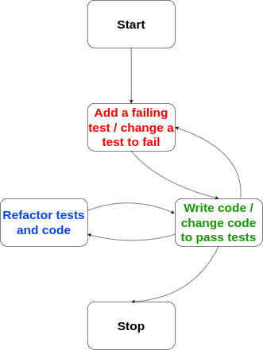

# Die sieben Schulen der TDD - Terms and Building Blocks

In alphabetic order, because we want to easily find each entry when mentioned.

## Back-door verification
The verification of behavior executed by a unit under test during test execution is called backdoor verification.
This can be achieved by injecting mocks for dependencies of a class used during tests and verify the interactions with that mock.

## Backward calculation

A refactoring replacing a value/result by an expression leading to that value. This is usually done several times in a row. The refactoring starts with a fake value specific to a test and is then generalized to an actual solution.

e.g replace "return 119"  with "return 100 * 1.19" with "return priceVale * vatRate"

This is typically used by Munich and St.Pauli.

## Double loop

The idea of the double loop is that there a two tdd-cycles:
1. An outer loop describing the Acceptance Tests for a feature or capability
2. An inner loop which drives the outer Acceptance Test by small unit tests

The typical process is to start with an acceptance test. Then use TDD with unit tests until the acceptance test is completely fulfilled, ie. it is green. Write the next acceptance test and write unit tests for the acceptance test again.
[^2]

## Front-door verification
The verification as part of a unit test can be done in different ways.

When interacting with the unit under test by methods available in production, this is the front-door verification technique.
There is also another technique called back-door verification.

When the unit under test returns a value during test, this return value can be used for verification.
Alternatively the state of a unit under test is used, by e.g. using getters.

## Inside Out Strategy
When deciding where to start with a system, you may choose to begin with small internal parts.
This strategy for development makes us think about designing small pieces with clear and single responsibility.
These pieces are assembled to build the complete system.
The opposite is outside in strategy.

## Mocks / Spies
Mocks and Spies are used to verify, that specific method-calls (with possibly specific arguments) are executed. Mocks are pre-programmed with their expectation, while Spies record their call and can be inspected later.

## Outside In Strategy
When deciding where to start with a system, one can choose to begin with the overall functionality.
This development strategy leads us to think about creating a black box and designing the interface at the system boundary.
Usually, the visible behavior of the system is the starting point.
After using all possible shortcuts and mostly faking the internal behavior, the required parts are discovered iteratively.

## Sociable Test
A class that contains unit tests refer to a class in a system.
E.g. class School refers to a class SchoolTest.
A class has dependencies, like other classes to fulfil the desired functionality.
If the test is also testing the dependent classes behaviour using the productive version, the test is called sociable.
The opposite is a solitary test.
Also see an article about solitary vs. sociable test[^4]

## Solitary Test
A class that contains unit tests refer to a class in a system.
E.g. class School refers to a class SchoolTest.
A class has dependencies, like other classes to fulfil the desired functionality.
If the test is explicitly testing the classes behaviour without the productive version of dependant classes, the test is called solitary.
Dependant classes can be replaced using fake objects.
The opposite is a sociable test.
Also see an article about solitary vs. sociable test[^4]

## Stub
Stubs provide canned answers to calls made during the test, usually not responding at all to anything outside what's programmed in for the test.[^1]

## Test driven development (TDD)
Summary: testing is an essential part of software development.
This was known even in the ancient days of software developement[^3].
Let tests guide the process of design a software system is key to TDD.
Beside the ongoing discussions around the pros and cons, this is the essential flow:

## Test Double
The following is an excerpt from Marting Fowlers text about test doubles[^1]
Gerard Meszaros is working on a book to capture patterns for using the various Xunit frameworks. One of the awkward things he's run into is the various names for stubs, mocks, fakes, dummies, and other things that people use to stub out parts of a system for testing. To deal with this he's come up with his own vocabulary which I think is worth spreading further.

The generic term he uses is a Test Double (think stunt double). Test Double is a generic term for any case where you replace a production object for testing purposes. There are various kinds of double that Gerard lists:
- Dummy objects
- Fake objects
- Stubs
- Spies
- Mocks

## Triangulation
In test driven development, assertions are used in tests as guidance and to derive logic.
One assertion might be not enough to start implementing logic.
This uncertainty can be tackled by using more than one assertion and fake implementation steps.
When clarity has come or patterns become visible, the logic is implemented.[^6]

## Validation test
When having a sociable test, there might be functionality tested implicitly by a test of another unit.
To guard this functionality explicitly, a designated test can be introduced.
This test created afterwards is called a validation test.

----
[^1]: https://martinfowler.com/bliki/TestDouble.html 
[^2]: https://www.sammancoaching.org/learning_hours/bdd/double_loop_tdd.html
[^3]: https://arialdomartini.wordpress.com/2012/07/20/you-wont-believe-how-old-tdd-is
[^4]: https://martinfowler.com/bliki/UnitTest.html
[^5]: https://site.mockito.org/javadoc/current/org/mockito/Spy.html
[^6]: https://dmitripavlutin.com/triangulation-test-driven-development/