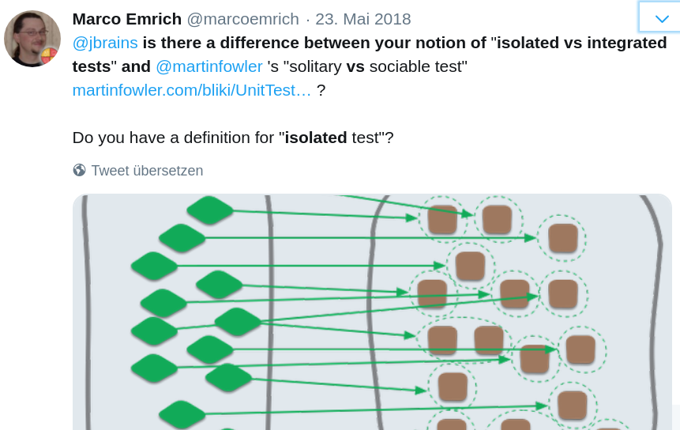
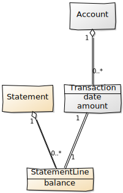
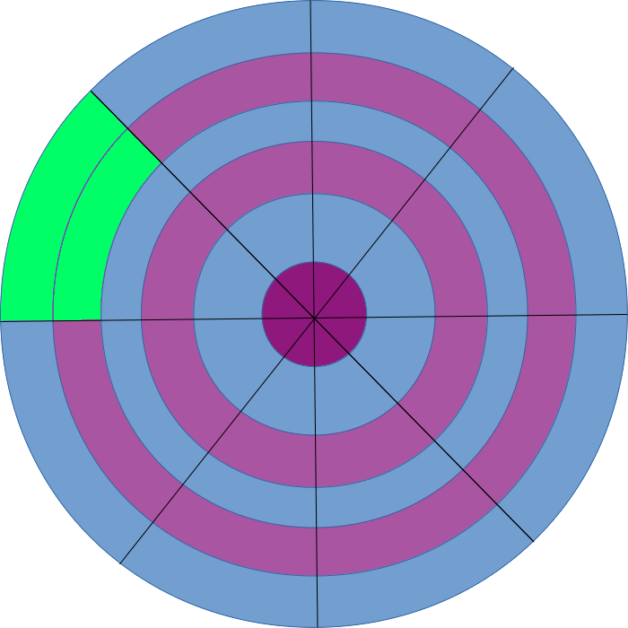
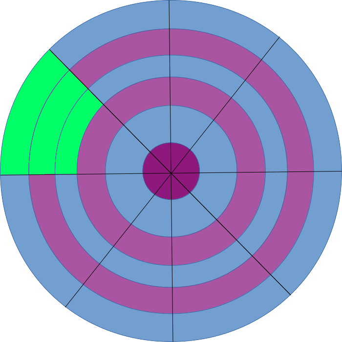
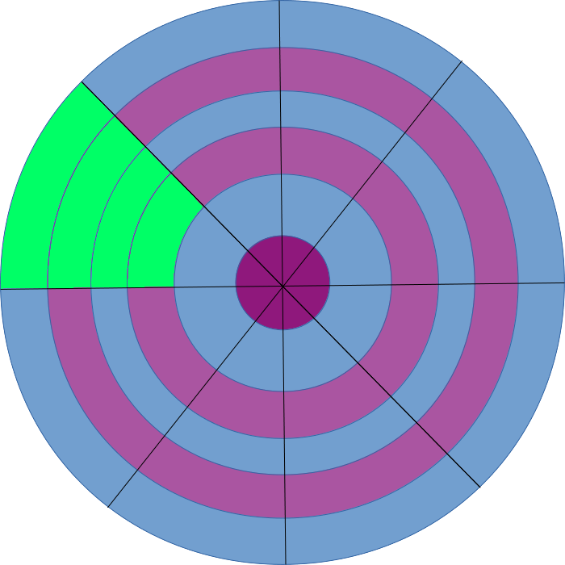
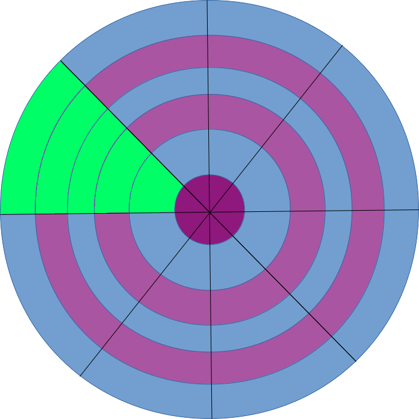

<!-- .slide: data-background="images/schools2.jpg"   -->

<h2 style="position: absolute; top: 470px; right: -150px; color: #ccc; text-transform: none;">Schools of TDD</h2>

<p style="position: absolute; top: 545px; right: -145px; color: #ccc; text-transform: none; text-align: right">@MarcoEmrich<br/>codecentric</p>

Note:

Wer weiß welche Schule das ist?
- hier werden die Besten Magier ausgebildet


---
# About TDD

---

# When?
# Who?

---

<h3 style="position: absolute; top: 300px; left: 70px">Invented</h3>

## 1957


### John von Neuman
---

<!-- .slide: data-background="images/punch_card.jpg"  -->

---

<h3 style="position: absolute; top: 250px; left: 670px">Rediscovered</h3>

## 1989


### Kent Beck

---

# 30 Years of TDD

Note: Dieses Jahr feiern wir also 30 Jahre TDD

---

# ...or 60 ?

---

## What happened in these years?

---

# Improving TDD-Skills Today?

Note:
und wie können wir denn Heute aus den letzten 30 Jahren lernen?
Gezielter die am besten passende Form für TDD anwenden
Bild TDD-Passung

---

<!-- .slide: data-background="images/ma1.jpg"  -->

<h2 style="position: relative; top: -200px; left: 400px; color: black;">Schools</h2>


Note:

Die Antwort auf beide Fragen lautet: Schulen

Werfen wir mal einen Blick auf MA. Da sind im Laufe der Zeit Schulen entstanden

---

<!-- .slide: data-background="images/ma2.jpg"  -->

Note: Manche Schulen verwenden Schläge oder Tritte

---

<!-- .slide: data-background="images/ma5.jpg"  -->

Note: Manche Würfe

---

<!-- .slide: data-background="images/ma3.jpg"  -->

Note: Manche Krabbeln sich

---

<!-- .slide: data-background="images/ma4.jpg"  -->

Note: Manche Kämpfen mit Waffen

---

<!-- .slide: data-background="images/sumo.jpg"  -->

Note: und manche ... pause ... egal

---
> There are a large number of distinct styles and schools of martial arts.

&mdash; Wikipedia: List_of_martial_arts

---

<!-- .slide: data-background="images/mas2.jpg"  -->

## Aikido <!--.element:  style="color: white; position: absolute; top: 600px; left: -160px;" -->


---

<!-- .slide: data-background="images/mas3.jpg"  -->

## Ninjitsu <!--.element:  style="color: black; position: absolute; top: 600px; left: -160px;" -->

---

<!-- .slide: data-background="images/mas1.jpg"  -->

## MCMAP <!--.element:  style="color: white; position: absolute; top: 600px; left: -160px;" -->

Note: Es gibt wirklich ganz unterschiedliche Stile

---


<!-- .slide: data-background="images/mas4.jpg"  -->

## Shalin Kungfu-Fu <!--.element:  style="color: white; position: absolute; top: 600px; left: -160px;" -->

---

<!-- .slide: data-background="images/mas_l.jpg"  -->

## Bride-Fu <!--.element:  style="color: black; position: absolute; top: 600px; left: -160px;" -->

---
<!-- .slide: data-background="images/mas5.jpg"  -->

## Cat-Fu <!--.element:  style="color: white; position: absolute; top: 600px; left: -160px;" -->

---
> Martial arts can be grouped by type or focus, or alternatively by <b>regional origin</b>.

&mdash; Wikipedia: List_of_martial_arts

---
# Three (?) Schools of TDD

Note:
Bild Schulen: Martial Arts?

---
<!-- .slide: data-background="images/map2.png"   -->

---
> Sometimes, schools or styles are introduced by <b>individual teachers</b> or masters, ...

&mdash; Wikipedia: List_of_martial_arts

---
<!-- .slide: data-background="images/chicago.jpg"  -->

## Chicago <!-- .element: style="color: black; font-weight: bold; position: relative; top: 250px; left: -150px" -->

---


## Kent Beck

---
<!-- .slide: data-background="images/london.jpg"  -->

## London <!-- .element: style="color: black; font-weight: bold; position: absolute; top: -200px; left: 800px" -->

---


## Nat Price & Steve Freeman

---
<!-- .slide: data-background="images/munich.jpg"  -->

## Munich <!-- .element: style="color: white; font-weight: bold; position: absolute; top: 400px; left: -40px" -->

---

## David Völkel

---
<!-- .slide: data-background="images/lego.jpg"  -->

## Terms  <!-- .element class="stroke"  -->
## &  <!-- .element: class="stroke"  -->
## Building Blocks <!-- .element: class="stroke"  -->

Note: Lego Joke

---
<!-- .slide: data-background="images/mouse.jpg" -->


<h2 style="position: relative; top: -300px" class="stroke">Subject under Test</h2>

---
## Subject under Test: SUT

 * Object
 * Function / Method
 * Module
 * Software System
 * ... something else?


<!-- TODO: Bild Back & Front -->

---
<!-- .slide: data-background="images/fire.jpg"  -->

## Test Doubles  <!-- .element class="stroke"  -->
### Mocks/Spies  <!-- .element: class="stroke"  -->
### Stubs  <!-- .element: class="stroke"  -->
### Fakes  <!-- .element: class="stroke"  -->
### Dummies <!-- .element: class="stroke"  -->

---
## Assertions
## &
## Expectations

---
## Frontdoor Testing
# vs
## Backdoor Testing


---
## Frontdoor Testing
* Result Verification
* State Verification

---
## Result verification
```javascript
test('add adds up two numbers', () => {
  expect( add(3, 4) ).toEqual(7);
});
```

---
## State verification
```javascript
test('addCardOnTop should increase number of Cards in Deck', () => {
  deck = new DeckOfCards();
  deck.addCardOnTop("♥9")
  expect(deck.numberOfCards).toEqual(1);
  expect(collectionSpy.topCard).toEqual("♥9");
});
```

---
## Backdoor Testing
* Behavior verification
* Test Doubles: Mocks & Spys

---

## Behavior verification
```javascript
test('addCardOnTop should call shuffle on collection', () => {
  const collectionSpy = {randomizeOrder: jest.fn()};
  deck = new DeckOfCards(collectionSpy);
  deck.shuffle();
  expect(collectionSpy.randomizeOrder).toHaveBeenCalled();
});
```
---
# Queries
# vs
# Commands

---

## Query

```javascript
  deck.numberOfCards
```

---

## Command

```javascript
  deck.addCardOnTop("♥9")
```

Note:
* wichtig zu Unterscheiden, 1000 E-Mail-Bsp
* Bertrand Meyer
* Basis für CQRS-Architektur (nicht heute)

-> Code Beispiele

---
## Command/Query Verification

### Query <!-- .element: style="text-align: left;" -->
* Result Verification

&nbsp;
&nbsp;
### Command <!-- .element: style="text-align: left;" -->
* State Verification
* Behavior Verification

---

### J.B. Rainsberger

## Integrated Tests<br> vs<br> Isolated Tests

---
### Martin Fowler / Jay Fields

## Sociable Tests<br> vs<br> Solitary Tests

Notes:

Aussprachhilfe vom Britten
https://dict.leo.org/german-english/sociable

---
## Sociable vs Solitary*

<sub>(*) stolen from M. Fowler</sub>
---



---


---
## Inside Out
# vs
## Outside In

---
<!-- .slide: data-background="images/cat.jpg" data-background-size="contain"  -->

<h1 style="position: relative; top: -270px;" class="stroke">Inside Out</h1>

---
## Inside Out


---
## Inside Out


---
## Inside Out


---
## Inside Out


---
## Inside Out


---
## Inside Out


---
## Inside Out


---
<!-- .slide: data-background="images/giraffe.jpg" data-background-size="contain" data-background-position="left 5% center" -->

<h1 style="position: absolute; right: 0px;" class="stroke">Outside In</h1>

---
## Outside In


---
## Outside In


---
## Outside In


---
## Outside In


---
## Outside In


---
## Outside In


---
## Outside In


---
# Schools

---

<!-- .slide: data-background="images/schools1.jpg" -->

Note: das ist die Schule von den Leuten, die kein TDD einsetzen

---

<!-- .slide: data-background="images/schools2.jpg"   -->

<h2 style="position: absolute; top: 470px; right: -50px; color: #ccc">Schools</h2>


---

# Compare?

Note:
 * Best matching Problem for each individual school
 * Same Problem for all Schools

---

# Example


---

# Bank Kata

---

<!-- .slide: data-background="images/kermit.jpg"  -->

---

<!-- .slide: data-background="images/bank.jpg"  -->

<h2 style="position: absolute; top: -100px; right: 0px; color: black">Bank Kata</h2>

```javascript
    account.deposit(1000);
    account.deposit(2000);
    account.withdraw(500);
    account.printStatement()
```
<!-- .element: class="fragment"-->


```
  Date       Amount Balance
  14.01.2019 +1000  1000
  15.01.2019 +2000  3000
  16.01.2019 -500   2500
```
<!-- .element: class="fragment"-->


```

---

## Bank Kata
* Original by Sandro Mancuso <br/>
  https://github.com/sandromancuso/Bank-kata
* Kata-Log by Egga Hartung<br />(Softwerkskammer Berlin) <br/>
  http://kata-log.rocks/banking-kata

---

<!-- .slide: data-background="images/katalog.png"  -->

---


## Big Up Front Design
## vs
## Emergent Design

---

## ~~BDUF~~

---

## Emergent Design?

---
<!-- .slide: data-background="images/brain.jpg" -->
# Brain-On-Mode <!-- .element: class="stroke" -->

Note:
TODO: Gehirn-Bild

---
<!-- .slide: data-background="images/brain.jpg" -->
# Think-Ahead-But-Not-Too-Much-Approach  <!-- .element: class="stroke" -->

---
<!-- .slide: data-background="images/bank.jpg"  -->



Note:

https://yuml.me

[Account]<>1-0..*[Transaction|date; amount],
[Transaction]1-1[StatementLine|balance{bg:wheat}],
[Statement {bg:wheat}]<>1-0..*[StatementLine|balance],


---
<!-- .slide: data-background="images/chicago.jpg"  -->

## Chicago<br/>(Classic) <!-- .element: style="color: black; font-weight: bold; position: relative; top: 250px; left: -150px" -->

---

## Chicago (Classic)

* Inside-Out <!-- .element: class="fragment" -->
* Integrated Tests <!-- .element: class="fragment" -->
* TestDoubles only for Outside-Deps <!-- .element: class="fragment" -->

---
Transaction

```javascript
describe('Transaction', () => {
  it('should hold date & amount', () => {
    const date = new Date(2019, 0, 10);
    const amount = 1200;

    const transaction = new Transaction(date, amount);

    expect(transaction.date).toEqual(date);
    expect(transaction.amount).toEqual(amount);
  })
});
```

```javascript
export class Transaction {
  constructor(date, amount) {
    this.date = date;
    this.amount = amount;
  }
}
```


---
formattedDate

```javascript
describe('formattedDate', () => {
  it('formats a string for a Date', () => {
    expect(
      formattedDate(new Date(2019, 0, 10))
    ).toEqual(
      "10.1.2019"
    );
  });
});
```

```javascript
export const formattedDate = date =>
  `${date.getDate()}` +
  `.${date.getMonth() + 1}` +
  `.${date.getFullYear()}`;
```
<!-- .element: class="fragment" -->

---
StatementLine

```javascript
describe('StatementLine#toString', () => {
  it('should return a formatted string', () => {
    const transaction = new Transaction(new Date(2019, 0, 10), 1000);

    const statementLine = new StatementLine(transaction, 3000);

    expect( statementLine.toString() ).toEqual(
      "10.1.2019\t+1000\t3000"
    );
  });
});
```

```javascript
export class StatementLine {
  toString() {
    return "10.1.2019\t+1000\t3000";
  }
}
```
<!-- .element: class="fragment" -->


---
Triangulation

```javascript
    ...
    expect( statementLine.toString() ).toEqual(
      "10.1.2019\t+1000\t3000"
    );
  });

  it('returns a formatted string for 2nd Transaction', () => {
    ...
    expect( statementLine.toString() ).toEqual(
      "14.1.2019\t+500\t2000"
  ...

```

```javascript
import { formattedDate } from "./formattedDate";
export class StatementLine {
...
toString() {
    return `${formattedDate(this.transaction.date)}\t` +
           `+${this.transaction.amount}\t` +
           `${this.balance}`;
  }
}
```

---
Statement - Spec

```javascript
describe('Statement', () => {
  it('should print a blank Statement', () => {
...
  it('should print a Statement with 1 Transaction', () => {
...
  it('should print a Statement with 2 Transactions', () => {
    const account = new Account();
    account.deposit(new Date(2019, 0, 10), 1000);
    account.deposit(new Date(2019, 0, 13), 2000);
    const statement = new Statement(account);
    expect( statement.toString() ).toEqual(
      "Date\tAmount\tBalance\n" +
      "10.1.2019\t+1000\t1000\n" +
      "13.1.2019\t+2000\t3000"
    );
  })
```
----
Statement - Implementation

```javascript
import { StatementLine } from "./StatementLine";

export class Statement {
  constructor(account) { this.account = account; }
  toString() {
    return "Date\tAmount\tBalance\n" +
      this.account.transactions
        .reduce(
          (lines, t) => lines.concat(new StatementLine(t, this.balanceForLines(lines) + t.amount)), []
        ).map(sl => sl.toString()).join("\n");
  }

  balanceForLines(lines) {...
  lastLine(lines) {...
  areLinesEmpty(lines) {...
}

```


---
Account

```javascript
  it('should add new Transactions on Deposit', () => {...
  it('should add two new Transactions on two Deposits', () => {
    const account = new Account();

    account.deposit(new Date(2019, 0, 10), 2000);
    account.deposit(new Date(2019, 0, 14), 1000);

    expect( account.transactions ).toEqual( [
      new Transaction(new Date(2019, 0, 10), 2000),
      new Transaction(new Date(2019, 0, 14), 1000),
    ] );
  });
```

```javascript
import { Transaction } from "./Transaction";
import { Statement } from "./Statement";

export class Account {
  constructor() { this.transactions = []; }

  deposit(date, amount) {
    this.transactions.push(new Transaction(date, amount));
  }
}
```
<!-- .element: class="fragment" -->


---

---
account.print()

```javascript
describe('Account', () => {
  ...
  it('should print a Statement', () => {
    const printFn = jest.fn();
    const account = new Account();
    account.deposit(new Date(2019, 0, 10), 2000);
    account.deposit(new Date(2019, 0, 14), 1000);
    account.print(printFn);
    expect(printFn).toHaveBeenCalledWith((new Statement(account)).toString());
  });
});
```

```javascript
import { Transaction } from "./Transaction";
import { Statement } from "./Statement";

export class Account {
  ...
  print(printFn) {
    const statement = new Statement(this);
    printFn(statement.toString());
  }

```
<!-- .element: class="fragment" -->


---
## Consequences of Chicago Classic

* \- Can be fragile <!-- .element: class="fragment"  style="color: red"-->
* \- Can be slow <!-- .element: class="fragment"  style="color: red"-->
* \- Defect Localization is hard <!-- .element: class="fragment"  style="color: red"-->

---
<!-- .slide: data-background="images/chicago.jpg"  -->

## Chicago<br/>(Modern) <!-- .element: style="color: black; font-weight: bold; position: relative; top: 250px; left: -150px" -->

---
## Chicago (Modern)
* J.B. Rainsberger
* Jay Fields
* Roy Osherove
* ...

---
## Chicago (Modern)

* Inside-Out <!-- .element: class="fragment" -->
* Isolated Tests <!-- .element: class="fragment" -->
* Lot of Stubs / Some Mocks <!-- .element: class="fragment" -->

---
Spec for SUT: StatementLine

```javascript
describe('StatementLine#toString', () => {
  it('should return a formatted string', () => {
    const transaction = new Transaction(new Date(2019, 0, 10), 1000);
    const statementLine = new StatementLine(transaction, 3000);
    expect( statementLine.toString() ).toEqual(
      "10.1.2019\t+1000\t3000"
    );
  });
```

```javascript
import { formattedDate } from "./formattedDate";

export class StatementLine {
  constructor(transaction, balance) {
    this.transaction = transaction;
    this.balance = balance;
  }
  toString() {
    return `${formattedDate(this.transaction.date)}\t+${this.transaction.amount}\t${this.balance}`;
  }
}
```

Note: wichtig: was ist unser SUT

* Wer erkennt die 2 Probleme
* Wer sieht die Abhängigkeiten? transaction, formattedDate
* Integrated mit: Transaction und formattedString
* Teste immer beides mit. formattedString ist weniger offensichtlich, aber auch Abhängigkeit
* Änderungen an formattedString brechen die statementLine -> Zeichen für kaputtes Design, natürlich sollte es möglich sein das Datumsformat eines anderen Landes zu verwenden.

---
SUT: StatementLine

```javascript
  it('should return a formatted string', () => {
    const transaction = new Transaction(new Date(2019, 0, 10), 1000);
    const statementLine = new StatementLine(transaction, 3000);
    ...
  });
```

&darr; Refactoring: replace Class with Stub

```javascript
  it('should return a formatted string', () => {
    const transaction = {date: new Date(2019, 0, 10), amount: 1000};
    const statementLine = new StatementLine(transaction, 3000);
    ...
  });
```


---
SUT: StatementLine

```javascript
export class StatementLine {
  ...
  toString() {
    return `${formattedDate(this.transaction.date)}\t+${this.transaction.amount}\t${this.balance}`;
  }
}
```

&darr; Refactoring: Inject Function Dependency

```javascript
export class StatementLine {
  ...
  toString(dateFormat) {
    return `${dateFormat(this.transaction.date)}\t+${this.transaction.amount}\t${this.balance}`;
  }
}
```

Note:
ok, wie werden wir die 2. Abhängigkeit los?
formattedDate ist harte Abhängigkeit

---
```javascript
  it('should return a formatted string', () => {
    const transaction = new Transaction(new Date(2019, 0, 10), 1000);
    const statementLine = new StatementLine(transaction, 3000);
    ...
  });
```

&darr; Refactoring: Inject Function Dependency

StatementLine Spec (isolated)

```javascript
  it('should return a formatted string', () => {
    const germanDateFormat = jest.fn().mockReturnValue("10.1.2019");
    const transaction = {date: new Date(2019, 0, 10), amount: 1000};

    const statementLine = new StatementLine(transaction, 3000);

    expect( statementLine.toString(germanDateFormat) ).toEqual(
      "10.1.2019\t+1000\t3000"
    );
  });
```
---
Refactoring: Rename Function

```javascript
import { germanDateFormat } from "./germanDateFormat";

describe('germanDateFormat', () => {
  it('should return a string for a Date formatted to the German standard', () => {
    expect(germanDateFormat(new Date(2019, 0, 10))).toEqual("10.1.2019");
  });
});
```

```javascript
export const germanDateFormat = date =>
  `${date.getDate()}.${date.getMonth() + 1}.${date.getFullYear()}`;
```

Note: das nächste Requirement für ein anderes Datumsformat kommt bestimmt.
Jetzt können wir es konfigurieren

---
## Consequences of Chicago Modern

<ul>
  <li class="fragment" style="color: green">+ ~~can be fragile~~ mostly stable</li>
  <li class="fragment" style="color: green">+ ~~Can be slow~~ blazing fast</li>
  <li class="fragment" style="color: green">+ Defect Localization is ~~hard~~ easy</li>

</ul>


---
## General Chicago Consequences

* \+ Useful for Emergent Design/Experimentation <!-- .element: class="fragment" style="color: green"-->
* \+ Applicable in most situations <!-- .element: class="fragment" style="color: green"-->
* \+ Easy to learn <!-- .element: class="fragment" style="color: green"-->
* \- Needs more Refactoring than London <!-- .element: class="fragment" style="color: red"-->
* \- Dead/useless code possible: YAGNI <!-- .element: class="fragment" style="color: red" -->

---

## Other Chicago Variants

* TDD as if you meant it
* Emergent TDD
* &hellip;

---
<!-- .slide: data-background="images/london.jpg"  -->

## London <!-- .element: style="color: black; font-weight: bold; position: absolute; top: -200px; left: 800px" -->

---

## London
## =
## Outside-In with Mocks

---
## London

Double Loop ATDD


stolen from Emily Bache

---
## London

* Double Loop ATDD
* Outside-In <!-- .element: class="fragment" -->
* Mocks as main Verification Mechanism <!-- .element: class="fragment" -->
* Less Refactoring <!-- .element: class="fragment" -->

---
Acceptance Spec

```javascript
describe('Banking Kata Acceptance Spec', () => {
  it('should print a Statement with two Deposits', () => {
    const printerFn = jest.fn();
    const account = new Account();
    account.deposit(Date(2012, 0, 10), 1000);
    account.deposit(Date(2012, 0, 13), 2000);

    account.print(printerFn);

    expect(printerFn).toHaveBeenCalledWith(
      "Date\tAmount\tBalance\n" +
      "10.1.2012\t+1000\t1000\n" +
      "13.1.2012\t+2000\t3000\n"
    );
  });
});
```
---
Acceptance Spec

```javascript
describe('Banking Kata Acceptance Spec', () => {
  it('should print a Statement with two Deposits', () => {
  ...
```

X-out

```javascript
xdescribe('Banking Kata Acceptance Spec', () => {
  it('should print a Statement with two Deposits', () => {
  ...
```

---
Account Spec

```javascript
describe('Account', () => {
  it('should add StatementLine of deposit to Statement', () => {
    const statement = {addLine: jest.fn()};
    const transaction = new Transaction(new Date(2012, 0, 13), 1000);
    const account = new Account(statement);

    account.deposit(new Date(2012, 0, 13), 1000);
    expect(statement.addLine).toHaveBeenCalledWith(
      transaction, 1000
    )
  });
```
Note:

 * wo fang ich an?
 * wichtig ist, was ich nicht tue: SUT formattedString
 * ElefantenSkulptur-Witz


---
Account

```javascript
class Account {
  constructor(statement) {
    this.statement = statement;
  }
  deposit(date, value) {
    this.statement.addLine(new Transaction(date, value), value);
  }
}
```
---
Account Spec

```javascript
describe('Account', () => {
  it('should add StatementLine of deposit to Statement', () => {
  ...

  it('should print Statement', () => {
    const statement = {print: jest.fn()};
    const account = new Account(statement);
    const printFn = jest.fn();
    account.printStatement(printFn);
    expect(statement.print).toHaveBeenCalledWith(printFn);
  });
});
```
---
Account

```javascript
class Account {
  ...
  printStatement(fn) {
    this.statement.print(fn);
  }
}
```

---
Statement

```javascript
describe('Statement', () => {
  it('should print Header', () => {
    const printFn = jest.fn();
    const statement = new Statement()
    statement.print(printFn);
    expect(printFn).toHaveBeenCalledWith('Date\tAmount\tBalance');
  });
});
```
---
Statement

```javascript
class Statement {
  print(printFn) {
    printFn('Date\tAmount\tBalance');
  }
}
```
---
Statement

```javascript
class Statement {
  print(printFn) {
    printFn('Date\tAmount\tBalance');
  }
}
```

Refactoring: Extract Constant

```javascript
class Statement {
  constructor() {
    this.STATEMENT_HEADER = 'Date\tAmount\tBalance';
  }

  print(printFn) {
    printFn(this.STATEMENT_HEADER);
  }
}
```
---
Statement Spec

```javascript
describe('Statement', () => {
  it('should print Header', () => {
    const printFn = jest.fn();
    const statement = new Statement()
    statement.print(printFn);
    expect(printFn).toHaveBeenCalledWith(statement.STATEMENT_HEADER);
  });
});
```
---
Statement Spec

```javascript
...
  it('should print each line', () => {
    const printFn = jest.fn();
    const statementLine1 = {print: jest.fn()};
    const statementLine2 = {print: jest.fn()};

    const statement = new Statement()
    statement.addLine(statementLine1);
    statement.addLine(statementLine2);
    statement.print(printFn);

    expect(statementLine1.print).toHaveBeenCalledWith(printFn);
    expect(statementLine2.print).toHaveBeenCalledWith(printFn);
  });
});```
---
Statement

```javascript
class Statement {
  constructor() {
    this.STATEMENT_HEADER = 'Date\tAmount\tBalance';
    this.lines = [];
  }

  addLine(statementLine) {
    this.lines.push(statementLine);
  }

  print(printFn) {
    printFn(this.STATEMENT_HEADER);
    this.lines.forEach(l => l.print(printFn));
  }
}
```
---

## London Consequences

---
<!-- .slide: data-background="images/glassbridge.jpg"  -->

Note:

das geht vielleicht nur mir so, weil ich einfach noch nicht so viel Erfahrung mit der
London School hab, aber manchmal fühl ich mich wie dieser Typ mit dem Hammer.

Steht auf der höchsten Fußbrücke der Welt, schaut runter durch die Verglasung und haut dann mal mit dem Hammer drauf. Ich weiß schon, das es irgendwie runter geht...

Aber ich würde den oberen bzw äußeren Loop nicht zu hoch ansetzen - zu lange im Rot bleiben
Andererseits hat London aber auch viele Vorteile...

---
## London Consequences

* \+ No YAGNI <!-- .element: class="fragment" style="color: green" -->
* \+ Obvious next step <!-- .element: class="fragment" style="color: green" -->
* Leads to "Tell Don't Ask"-design <!-- .element: class="fragment" -->
* Easier for known designs <!-- .element: class="fragment" -->
* \- Design harder to refactor <!-- .element: class="fragment" style="color: red" -->
* \- Mocking is hard <!-- .element: class="fragment" style="color: red" -->

Notes:

 * YAGNI: formattedString: brauch ich das?, kein Beweis
 * Vielleicht stell ich später fest, ich hab' ne Methode implementiert, die ich gae nicht benutze
 * Bei London kann das nicht passieren
 * Obvious Next Step ist eine Prop von Outside-In
 * Harder to refactor: Test zementieren Implementierung

---
<!-- .slide: data-background="images/fire.jpg"  -->

## Test Doubles  <!-- .element class="stroke"  -->
## Mocks  <!-- .element: class="stroke"  -->

Note:
Der Test Double Typ, den London am meisten Verwendet sind Mocks!
und wie das mit Stunts manchmal ist, Sie können auch schief gehen...

---
<!-- .slide: data-background="images/stunt1.jpg" data-background-size="contain" -->
---
<!-- .slide: data-background="images/stunt2.jpg" data-background-size="contain" -->
---
<!-- .slide: data-background="images/stunt3.jpg" data-background-size="contain" -->

---
<!-- .slide: data-background="images/munich.jpg"  -->

## Munich <!-- .element: style="color: white; font-weight: bold; position: absolute; top: 400px; left: -40px" -->

---
## Munich
## =
## Fake-It Outside-In

Note: Wenn ihr das nächste Mal nach München unterwegs seid:
wir fahren heute nach Fake It Ouside-In

---
# Munich

* Outside-In <!-- .element: class="fragment" -->
* with or without Mocks <!-- .element: class="fragment" -->
* Very Large Amount of Refactorings <!-- .element: class="fragment" -->

---

## Munich


---

## Munich


---

## Munich



---

## Munich



---

## Munich



---

## Munich



---

## Munich


---

## Munich


---

## Munich


---

## Munich


---

## Munich


---

## Munich


---

## Munich


---

## Munich


---
Outer Spec

```javascript
describe('Account', () => {
  it('should print the correct statement after withdraws and deposits', () => {
    const account = new Account();
    account.deposit(new Date(2012, 0, 10), 1000);
    account.deposit(new Date(2012, 0, 13), 2000);

    expect(
      new Statement(account).toString()
    ).toEqual(
      "Date\tAmount\tBalance\n" +
      "10.1.2012\t+1000\t1000\n" +
      "13.1.2012\t+2000\t3000"
    );
  });
});

```

Note:

toString() statt print wegen Rückgabewert
kein Double Loop -> machen wir grün
keine Mocks

---
Fake-It

```javascript
class Account {
  deposit(date, amount) {}
}

class Statement {
  constructor(account) {}

  toString() {
    return "Date\tAmount\tBalance\n" +
      "10.1.2012\t+1000\t1000\n" +
      "13.1.2012\t+2000\t3000";
  }
}
```

Note:

kein Double Loop -> machen wir grün
keine Mocks

---

```javascript
class Statement {
  constructor(account) {}

  toString() {
    return "Date\tAmount\tBalance\n" +
      "10.1.2012\t+1000\t1000\n" +
      "13.1.2012\t+2000\t3000";
  }
}
```

Refactoring

```javascript
class Statement {
  constructor(account) {}

  toString() {
    const statementLines = [
      "Date\tAmount\tBalance",
      "10.1.2012\t+1000\t1000",
      "13.1.2012\t+2000\t3000"];
    return statementLines.join('\n')
  }
}
```
---
```javascript
  toString() {
    const statementLines = [
      "Date\tAmount\tBalance",
      "10.1.2012\t+1000\t1000",
      "13.1.2012\t+2000\t3000"];
    return statementLines.join('\n')
  }
```

Refactoring

```javascript
  toString() {
    this.STATEMENT_HEADER = "Date\tAmount\tBalance";
    this.statementLines = [
      "10.1.2012\t+1000\t1000",
      "13.1.2012\t+2000\t3000"
    ];
    const statementLines =
      [this.STATEMENT_HEADER].concat(this.statementLines);
    return statementLines.join('\n')
  }
```
---
```javascript
  toString() {
    this.STATEMENT_HEADER = "Date\tAmount\tBalance";
    this.statementLines = ["10.1.2012\t+1000\t1000", "13.1.2012\t+2000\t3000"];
    const statementLines =
      [this.STATEMENT_HEADER].concat(this.statementLines);
    return statementLines.join('\n')
  }
```

Refactoring

```javascript
  constructor(account) {
    this.STATEMENT_HEADER = "Date\tAmount\tBalance";
    this.statementLines = [
      "10.1.2012\t+1000\t1000",
      "13.1.2012\t+2000\t3000"
    ]
  }
  toString() {
    const statementLines =
      [this.STATEMENT_HEADER].concat(this.statementLines);
    return statementLines.join('\n')
  }
```
---
```javascript
  toString() {
    const statementLines =
      [this.STATEMENT_HEADER].concat(this.statementLines);
    return statementLines.join('\n')
  }
```

Refactoring: Inline Variable

```javascript
class Statement {
  ...
  toString() {
    return [this.STATEMENT_HEADER]
      .concat(this.statementLines)
      .join('\n');
  }
}
```

---
```javascript
  constructor(account) {
    this.STATEMENT_HEADER = "Date\tAmount\tBalance";
    this.statementLines = [
      "10.1.2012\t+1000\t1000",
      "13.1.2012\t+2000\t3000"
    ]
  }
```

Refactoring: Introduce Class

```javascript
  constructor(account) {
    this.STATEMENT_HEADER = "Date\tAmount\tBalance";
    this.statementLines = [
      new StatementLine("10.1.2012\t+1000\t1000"),
      new StatementLine("13.1.2012\t+2000\t3000")
    ]
  }
...

class StatementLine {
  constructor(line)  {this.line = line;}
  toString() {return this.line;}
}
```
---

```javascript
describe('StatementLine#toString', () => {
  it('should return a tab-separated String', () => {
    const transaction = new Transaction("21.2.2012", "+1000");
    const statementLine = new StatementLine(transaction, 4000);
    expect( statementLine.toString() ).toEqual(
      "21.2.2012\t+1000\t4000"
    );
  });
});
```
---
```javascript
class StatementLine {
  constructor(transaction, balance)  {
    this.transaction = transaction;
    this.balance = balance;
  }
  toString() {
    return [
      this.transaction.date,
      this.transaction.amount,
      this.balance
    ].join('\t');
  }
}
```
---
```javascript
class Transaction {
  constructor(date, amount) {
    this.date = date;
    this.amount = amount;
  }
}
```
---
```javascript
class Statement {
  constructor(account) {
    this.STATEMENT_HEADER = "Date\tAmount\tBalance";
    this.statementLines = [
      new StatementLine("10.1.2012\t+1000\t1000"),
      new StatementLine("13.1.2012\t+2000\t3000")
    ]
  }
  ...
```

Refactoring: Split Arguments

```javascript
class Statement {
  constructor(account) {
    this.STATEMENT_HEADER = "Date\tAmount\tBalance";
    this.statementLines = [
      new StatementLine(new Transaction("10.1.2012", "+1000"), 1000),
      new StatementLine(new Transaction("13.1.2012", "+2000"), 3000)
    ]
  }
  ...

```

---
```javascript
class Statement {
  constructor(account) {
    this.STATEMENT_HEADER = "Date\tAmount\tBalance";
    this.statementLines = [
      new StatementLine(new Transaction("10.1.2012", "+1000"), 1000),
      new StatementLine(new Transaction("13.1.2012", "+2000"), 3000)
    ]
  }
  ...
```

Refactoring

```javascript
class Account {
  constructor()  {
    this.transactions = [
      new Transaction("10.1.2012", "+1000"),
      new Transaction("13.1.2012", "+2000")
...

class Statement {
  constructor(account) {
    this.STATEMENT_HEADER = "Date\tAmount\tBalance";
    this.statementLines = [
      new StatementLine(account.transactions[0], 1000),
      new StatementLine(account.transactions[1], 3000)
    ]
  }
```

---
```javascript
class Account {
  constructor()  {
    this.transactions = [
      new Transaction("10.1.2012", "+1000"),
      new Transaction("13.1.2012", "+2000")
...
```
Refactoring

```javascript
class Account {
  constructor()  {
    this.transactions = []
  }
  deposit(date, amount) {
    this.transactions.push(new Transaction(formattedDate(date), "+" + amount))
  }
}
```

---
```
class Statement {
  constructor(account) {
    this.STATEMENT_HEADER = "Date\tAmount\tBalance";
    this.statementLines = [
      new StatementLine(account.transactions[0], 1000),
      new StatementLine(account.transactions[1], 3000)
    ]
  }
  ...
```

Refactoring

```javascript
class Statement {
  constructor(account) {
    this.STATEMENT_HEADER = "Date\tAmount\tBalance";
    this.statementLines = account.transactions.map(
      (t, i, ts) => new StatementLine(t, balance(ts, i))
    );
  }
```
---
## Munich Consequences

* \+ No YAGNI <!-- .element: class="fragment" style="color: green" -->
* \+ Obvious next step <!-- .element: class="fragment" style="color: green" -->
* \+ ...from many choices <!-- .element: class="fragment" style="color: green" -->
* \- ...from many choices <!-- .element: class="fragment" style="color: red" -->
* \+ No Mocks needed!!! <!-- .element: class="fragment" style="color: green" -->
* Higher Amount of Time in Green <!-- .element: class="fragment" -->
* Emergent Design Outside-In! <!-- .element: class="fragment" -->

Note:

Obvious Next Step (Prop. von Outside-In) ist noch stärker als bei London (Prop. of Fake It)

---
<!-- .slide: data-background="images/trophy.jpg"   -->

# Best School? <!-- .element: class="stroke" style="position:relative; top: -200px " -->

Note:
wer hat gewonnen?

---
> It depends™

&mdash; any Consultant <!-- .element: class="fragment" -->

ever <!-- .element: class="fragment" -->
---
<!-- .slide: data-background="images/tools.jpg"   -->
## Choose <!-- .element: class="stroke" -->
## Best Tool <!-- .element: class="stroke" -->
## for the job <!-- .element: class="stroke" -->

---
# Depends on WHAT?

---
# Questions ???

---
# FP or OOP?

---
# Design?
## Query vs Commands
## Distributed?

---
## Experimental
## or
## Known Design?

---

## Degree of Certainty
## vs.
## Amount of Refactoring

---
<!-- .slide: data-background="images/blend.png"   -->

# Will it blend? <!-- .element: class="stroke" style="position:relative; top: -70px " -->

---

## References: General

* [Interview with Kent Beck](https://arialdomartini.wordpress.com/2012/07/20/you-wont-believe-how-old-tdd-is)
* [Martin Fowler: Mocks aren't Stubs](https://martinfowler.com/articles/mocksArentStubs.html#SoShouldIBeAClassicistOrAMockist)
* [Martin Fowler: Solitary or Sociable](https://martinfowler.com/bliki/UnitTest.html)
* [David Völkel:  Mockist vs Classicists](https://www.youtube.com/watch?v=n62HN2DHDEU) - [Slides](https://de.slideshare.net/davidvoelkel/mockist-vs-classicists-tdd-69505839)
* Book ATDD by Markus Gärtner


---
## References: Chicago

* [J.B. Rainsberger: Integrated Tests are a Scam](https://blog.thecodewhisperer.com/permalink/integrated-tests-are-a-scam)
* [J.B. Rainsberger: Universal Architecture](https://www.red-gate.com/blog/software-development/universal-architecture)
* [Justin Seals: Detroit school TDD](https://github.com/testdouble/contributing-tests/wiki/Detroit-school-TDD)
* Book: Test-Driven Development by Kent Beck

---
## References: London

* [Emily Bache: Double-Loop TDD](http://coding-is-like-cooking.info/2013/04/outside-in-development-with-double-loop-tdd/)
* Book: Growing Object Oriented Software Guided by Tests by Steve Freeman & Nat Price

---
## References: Munich
* [David Völkel: Fake-it Outside-In](https://de.slideshare.net/davidvoelkel/fake-it-outsidein-tdd-xp2017)
* [David Völkel: Screencasts (Youtube)](https://www.youtube.com/channel/UCevhQwU63dxJYPb8sZY-Zgg)

---


---
### Image Credits

<ul style="font-size: 15px">

* Animal Mouse by Tiburi on Pixabay, CC0
* Kent Beck by Improve It on Flickr, CC BY-SA 2.0
* Making of Harry Potter - Karen Roe on Flickr, CC BY 2.0
* abandoned classroom - Troy Edige on Flickr, CC BY-ND
* Kickbox training - Pe_Wu on Flickr, CC BY-NC-ND 2.0
* Präfektursmeisterschaft - Christian Kaden  www.Japan-Kyoto.de, CC BY-NC-ND 2.0
* Sumo: anaterate on Pixaby, CC0
* Children practicing Taekwondo in Kathmandu, Nepal by Adli Wahid on Unsplash, CC0
* Sometimes you have to toss a man by Doshinkan Aikido on Flickr, CC BY-NC-ND 2.0
* Shaolin Masters by Kevin Poh on Flickr, CC-BY 2.0
* Girl having a great time by Nathan Rupert Follow on Flickr, CC BY-NC-ND 2.0
* Ninja Sword Training on the Beach by NinjaGym™ NinjaGym.com, CC BY-ND 3.0
* Bride Goku by Sean Molin on Flickr, CC BY-NC-ND 2.0
* Watch Where You're Putting That Thing: Chris Gilmore Follow, CC BY-SA 2.0
* Sunset jumping in kukishinden ryu sword kata by Akban Martial arts academy on Flickr, CC BY-SA 2.0
* Philippine Marine Corps Martial Arts Program class by U.S. Indo-Pacific Command on Flickr, CC BY-NC-ND 2.0
* Catfight by Ninja M. on Flickr, CC BY-NA-SA 2.0
* [Map images from Googlemaps](https://drive.google.com/open?id=19PMzl5GRQOqTpN3WY9Z__lpoMaA8mzY3&usp=sharing)
* Punchcard WikiImages on Pixabay, CC0
* Drunken Kermit by Alexas Fotos on Pixabay, CC0
* Skyline Skyscraper by PIRO4D on Pixabay, CC0
* Detroit Photo by Sawyer Bengtson on Unsplash, CC0
* London Photo by Luca Micheli on Unsplash, CC0
* Munich Photo by Christoph Keil on Unsplash, CC0
* Lego Photo by Rick Mason on Unsplash, CC0
* Aerial view Zhangjiajie glass bridge by www.highestbridges.com
* Fire Motorcycle Stunt by digihanger on Pixabay, CC0
* Trophy by Fauzan Saari on Unsplash, CC0
* iPhone in Blender from Blendtec's Will It Blend? https://www.youtube.com/watch?v=lBUJcD6Ws6s
* Brain by geralt on Pixabay, CC0
</div>

---

# THX

@MarcoEmrich

Notes:

Mache das wie M: Fowler
Refactoring 2nd Edition in JS
Auf die Frage warum JS statt Java hat er nur geantworted

"It's no 1998 anymore..."

Ich lass das mal so stehen.

TODO:
 * Next Episode: TDD Workflows

