<!-- .slide: data-background="images/schools2.jpg"   -->

<h2 style="position: absolute; top: 370px; right: -150px; color: #ccc; text-transform: none;">Schools of TDD - An Overview</h2>

<p style="position: absolute; top: 445px; right: -145px; color: #ccc; text-transform: none; text-align: right" class="handles">
  Thorsten Brunzendorf (@thbrunzendorf) - @MarcoEmrich
</p>

<br/><br/><br/><br/><br/><br/><br/>

Note:

Wer weiß welche Schule das ist?

- hier werden die Besten Magier ausgebildet

---

<!-- .slide: data-background="images/rgf.png" data-background-size="contain" -->

# About TDD <!-- .element style="position: absolute; left: 650px; top: -300px" -->

---

<!-- .slide: data-background="images/rgf.png" data-background-size="contain" -->

# Who?<br />When? <!-- .element style="position: absolute; left: 680px; top: -300px" -->

---

<h3 style="position: absolute; top: 300px; left: 70px">Invented</h3>

## 1957


### John von Neuman

---

<!-- .slide: data-background="images/punch_card.jpg"  -->

---

<h3 style="position: absolute; top: 250px; left: 670px">Rediscovered</h3>

## 1989

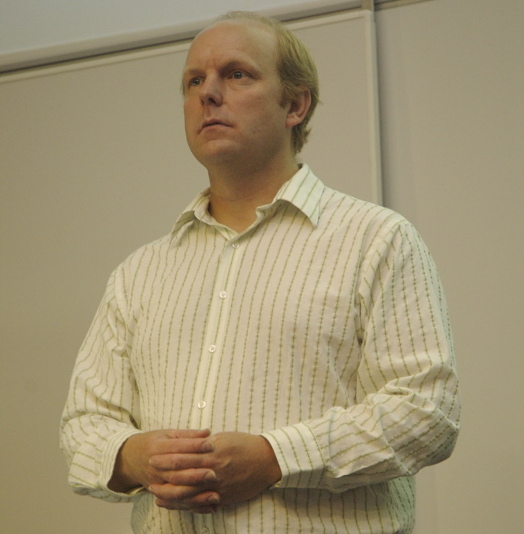

### Kent Beck

---

<!-- .slide: data-background="images/lego.jpg"  -->

## Terms

## &

## Building Blocks

Note: Lego Joke

---

<!-- .slide: data-background="images/backdoor_g.jpg"  -->

<h2 style="position: absolute; top: 300px; left: -160px;" -->Frontdoor<br />vs<br />Backdoor Testing</h2>

---

### Result verification (Frontdoor)

```javascript
expect(add(3, 4)).toEqual(7);
```

### State verification (Frontdoor)

```javascript
deck = new DeckOfCards(31);
deck.addCardOnTop("♥9");
expect(deck.numberOfCards).toEqual(32);
```

### Behavior verification (Backdoor)

```javascript
pushSpy = jest.spyOn(Array.prototype.push);
deck.addCardOnTop("♥9");
expect(pushSpy).toHaveBeenCalledWith("♥9");
```

---

<!-- .slide: data-background="images/fire.jpg"  -->

## Test Doubles

### Mocks (Spies)

### Stubs

---

<!-- .slide: data-background="images/mock_stubs.png" data-background-size="contain"  -->

---

### Example

```javascript
class Person {
  constructor(id) {
    this.id = id;
  }

  read(id) {
    //fetch from API
  }

  fullName() {
    const personData = this.read(this.id);
    return personData.firstName + " " + personData.name;
  }
}
```

---

### Stub

```javascript
const p = new Person(27);
const readSpy = jest.spyOn(p, "read");
readSpy.mockReturnValue({ name: "Wonder", firstName: "Alice" });
expect(p.fullName()).toEqual("Alice Wonder");
```

### Mock

```javascript
const p = new Person(27);
const readSpy = jest.spyOn(p, "read");
p.fullName();
expect(readSpy).toHaveBeenCalledWith(27);
```

---

## Sociable vs Solitary\*


<sub>(*) from M. Fowler/ J. Fields</sub>

---

## Inside Out

# vs

## Outside In

---

<!-- .slide: data-background="images/cat.jpg" -->

<h1 style="position: relative; top: -270px;"> Inside Out</h1>

---

## Inside Out

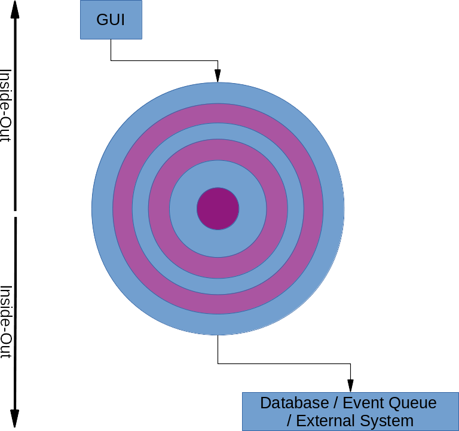

---

## Inside Out

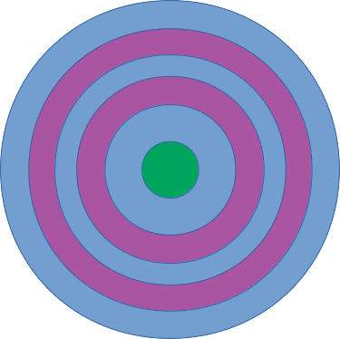

---

## Inside Out

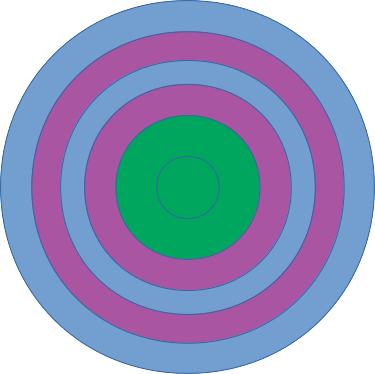

---

## Inside Out

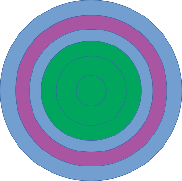

---

## Inside Out

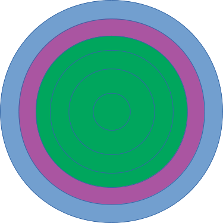

---

## Inside Out

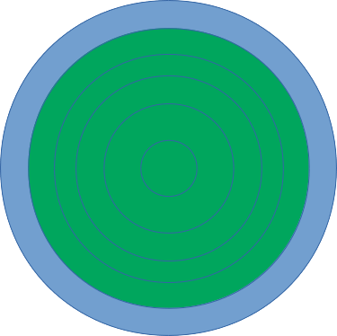

---

## Inside Out

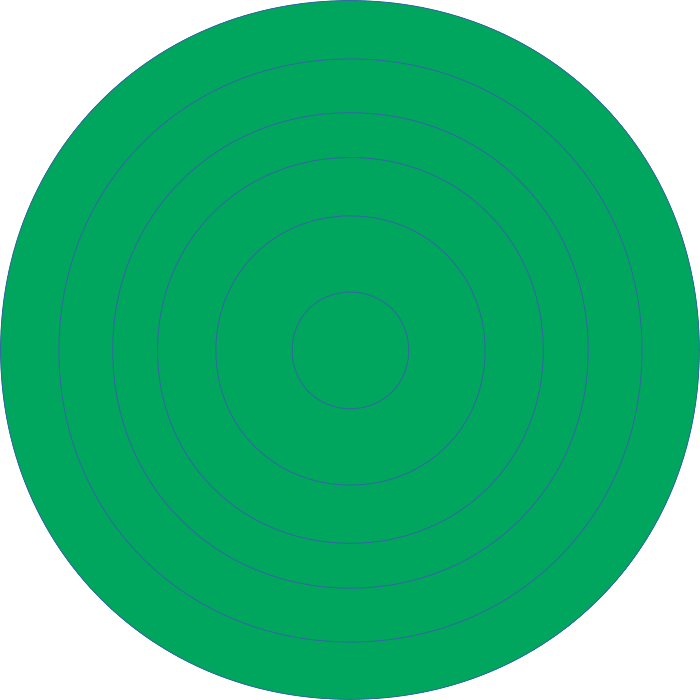

---

<!-- .slide: data-background="images/giraffe.jpg" data-background-size="contain" data-background-position="left 5% center" -->

<h1 style="position: absolute; right: 0px;"> Outside In</h1>

---

## Outside In

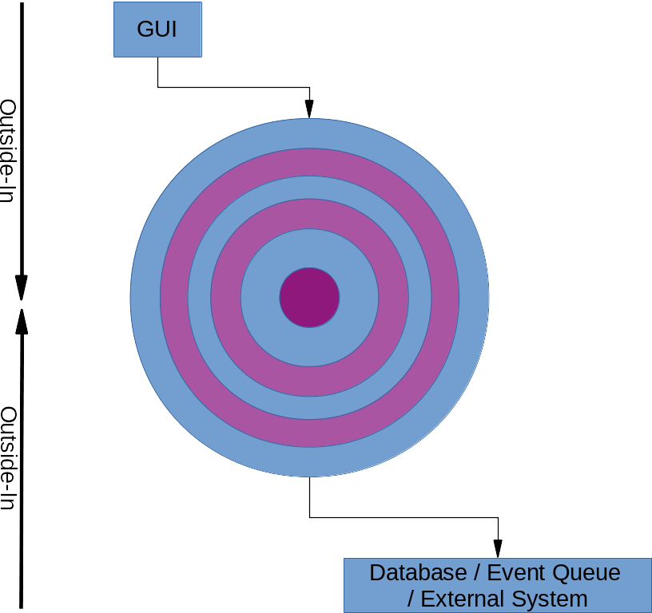

---

## Outside In

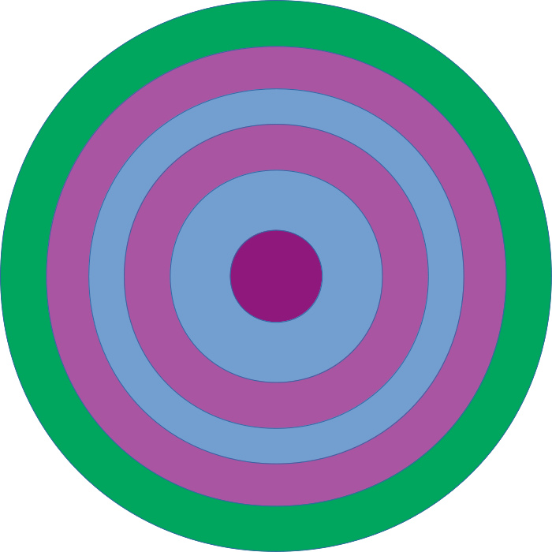

---

## Outside In

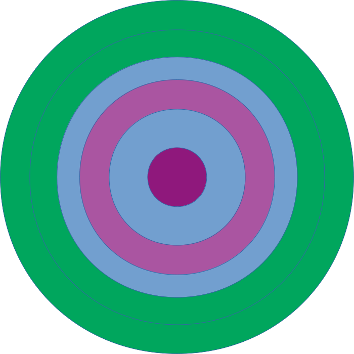

---

## Outside In

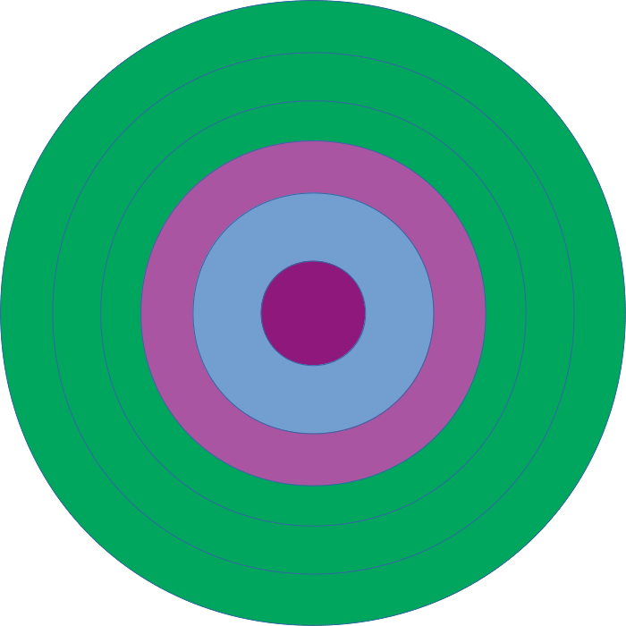

---

## Outside In

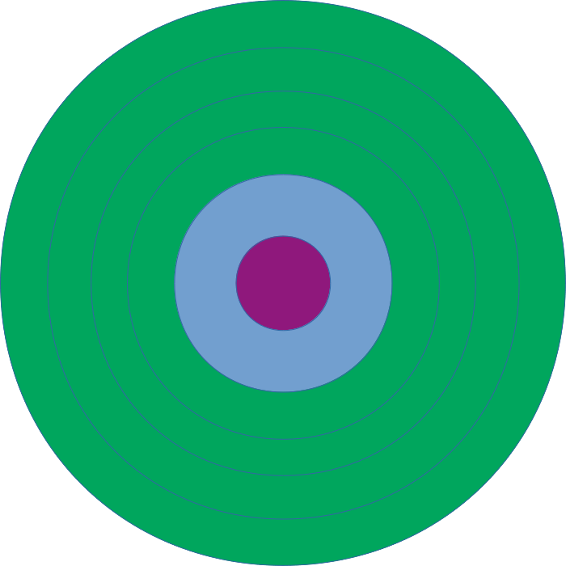

---

## Outside In

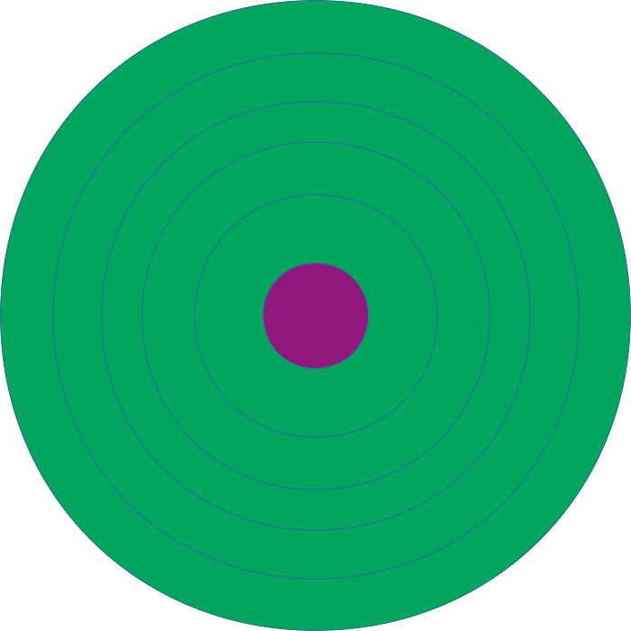

---

## Outside In


---

<!-- .slide: data-background="images/schools2.jpg"   -->

## 30-60 Years of TDD

## What happened in these years?

---

<!-- .slide: data-background="images/ma1.jpg"  -->

<h2 style="color: white; position: relative; top: -200px">Schools / Styles ...</h2>

---

<!-- .slide: data-background="images/ma1_g.jpg"  -->

## TDD-Schools / Styles

- Chicago/Detroit
- London
- Munich
- St.Pauli
- Hamburg
- TDD as if You Meant It

---

<!-- .slide: data-background="images/chicago.jpg"  -->

## Chicago <!-- .element: style="position: relative; top: 250px; left: -150px" -->

---

<!-- .slide: data-background="images/chicago_g.jpg"  -->

## Kent Beck


----
<!-- .slide: data-background="images/chicago_g.jpg"  -->

## Classic vs Modern <!-- .element: style="position: relative; top: 250px; left: -150px" -->

---

<!-- .slide: data-background="images/chicago_g.jpg"  -->

## Chicago (Classic)

- Inside-Out
- Sociable Tests
- TestDoubles only for external Deps

---

<!-- .slide: data-background="images/chicago_g.jpg"  -->

## Consequences of Chicago Classic

- Can be fragile <!-- .element: style="color: red"-->
- Can be slow <!-- .element: style="color: red"-->
- Defect Localization is hard <!-- .element: style="color: red"-->

---

<!-- .slide: data-background="images/chicago_g.jpg"  -->

## Chicago (Modern)

- J.B. Rainsberger
- Jay Fields
- Roy Osherove, G. Meszaros, ...
- K. Beck


---

<!-- .slide: data-background="images/chicago_g.jpg"  -->

## Chicago (Modern)

- Inside-Out
- **Solitary/Isolated Tests**
- Many Stubs
- Mocks only if needed

---

<!-- .slide: data-background="images/chicago_g.jpg"  -->

## Consequences of Chicago (Modern)

<ul>
  <li style="color: #4dff4dbd">+ ~~can be fragile~~ mostly stable</li>
  <li style="color: #4dff4dbd">+ ~~Can be slow~~ blazing fast</li>
  <li style="color: #4dff4dbd">+ Defect Localization is ~~hard~~ easy</li>
  <li style="color: red">- Additional Integration Tests needed</li>

</ul>

---

<!-- .slide: data-background="images/london.jpg"  -->

## London <!-- .element: style="position: absolute; top: -200px; left: 800px" -->

---

<!-- .slide: data-background="images/london_g.jpg"  -->

## Nat Price & Steve Freeman

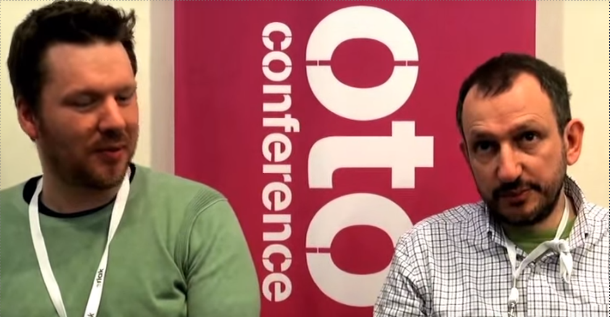
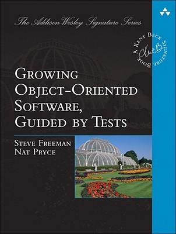

---

<!-- .slide: data-background="images/london_g.jpg"  -->

## Motivation

### Outside-In &rarr; Prevent YAGNI\*

\*You Ain't Gonna Need It

---

<!-- .slide: data-background="images/london_g.jpg"  -->

## London

- Outside-In
- Solitary/Isolated Tests
- Mocks for Verification

---

<!-- .slide: data-background="images/london_g.jpg"  -->

## Patterns & Principles

- Double Loop ATDD (Pryce, Freeman, Bache)
- Behaviour Verification via Mocks (Mackinnon, Freeman, Craig)

---

<!-- .slide: data-background="images/london_g.jpg"  -->

## Double Loop ATDD

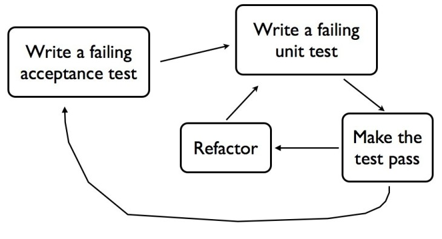

\*from Emily Bache

---

<!-- .slide: data-background="images/london_g.jpg"  -->

## London Consequences

- "Tell Don't Ask"-design <!-- .element:  -->
- \+ Prevents YAGNI <!-- .element:  style="color: #4dff4dbd" -->
- \+ On-Rails <!-- .element:  style="color: #4dff4dbd" -->
- \+ Less refactoring <!-- .element:  style="color: #4dff4dbd" -->
- \- Hard to refactor <!-- .element: style="color: red" -->
- \- Mocking is hard <!-- .element: style="color: red" -->

---

<!-- .slide: data-background="images/stunt_gone_wrong.jpg" -->
<div style="position: relative; top: 300px">

<h2>Mocks</h2>

<ul>
  <li>Often reduce Refactorability</li>
  <li>Often reduce Readability</li>
</ul>

</div>

---

<!-- .slide: data-background="images/munich.jpg"  -->

<div style="position: absolute; top: 400px; left: -50px">
  <h2>Munich</h2>
  <h3>(Fake-it Outside-In)</h3>
</div>

---

<!-- .slide: data-background="images/munich_g.jpg"  -->

## David Völkel

---

<!-- .slide: data-background="images/munich_g.jpg"  -->

## Motivation

### Outside-In without Mocks

---

<!-- .slide: data-background="images/munich_g.jpg"  -->

## Munich

- Outside-In
- **In-Production-Stubs/Fakes** (intermediate!)
- Avoids Mocks
- Refactoring-based
- Complex Acceptance Test

---

<!-- .slide: data-background="images/munich_g.jpg"  -->

## Patterns & Principles

- Fake-It (K.Beck, L.Falco, J.Searls)
- Preparatory Refactoring (K.Beck)
- Double Loop ATDD (E.Bache, N.Pryce/S.Freeman)
- Integration/Operation-Segregation-Principle (R.Westphal)
- **Backward Calculation** (D.Völkel)
- Intermediate Test (D.Völkel)

---

<!-- .slide: data-background="images/munich_g.jpg"  -->

## Munich

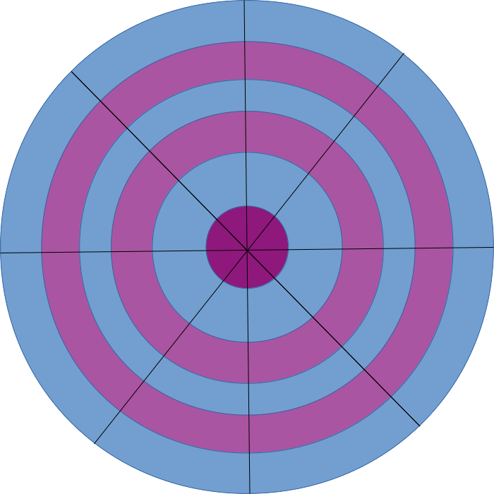

---

<!-- .slide: data-background="images/munich_g.jpg"  -->

## Munich

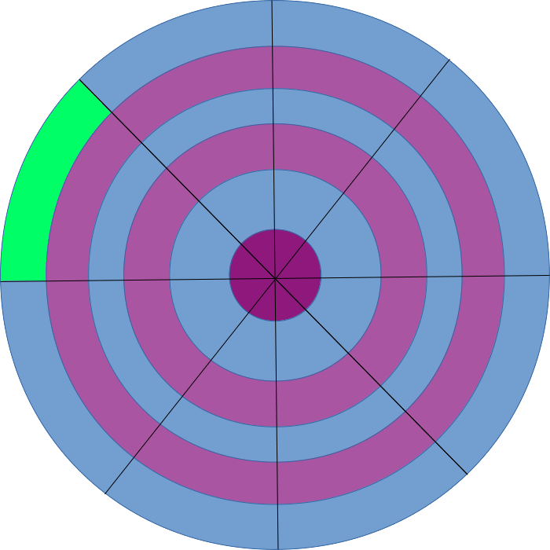

---

<!-- .slide: data-background="images/munich_g.jpg"  -->

## Munich

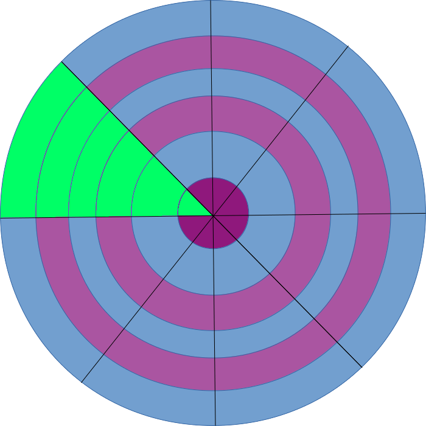

---

<!-- .slide: data-background="images/munich_g.jpg"  -->

## Munich

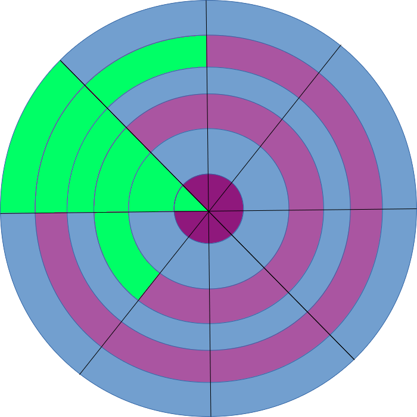

---

<!-- .slide: data-background="images/munich_g.jpg"  -->

## Munich

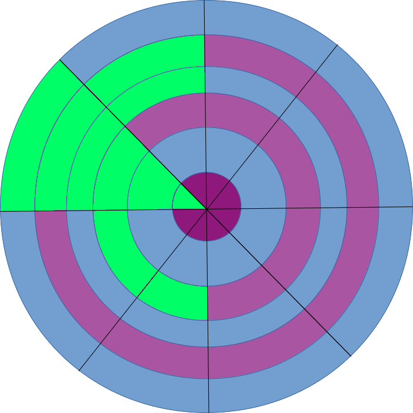

---

<!-- .slide: data-background="images/munich_g.jpg"  -->

## Munich

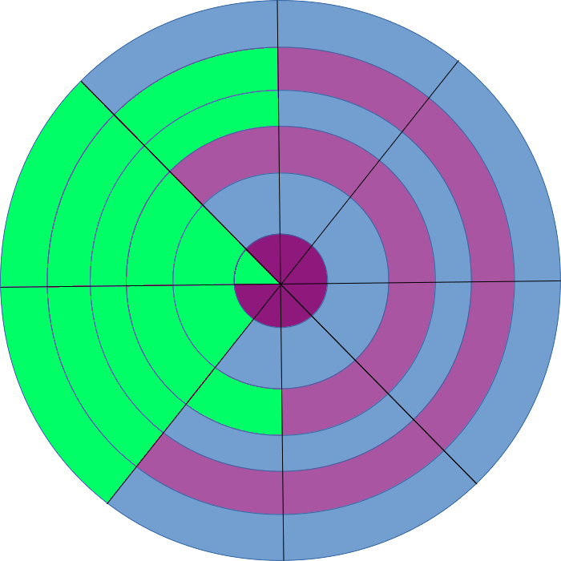

---

<!-- .slide: data-background="images/munich_g.jpg"  -->

## Munich

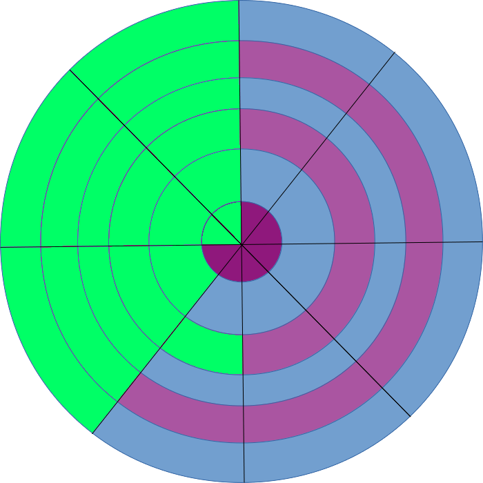

---

<!-- .slide: data-background="images/munich_g.jpg"  -->

## Munich

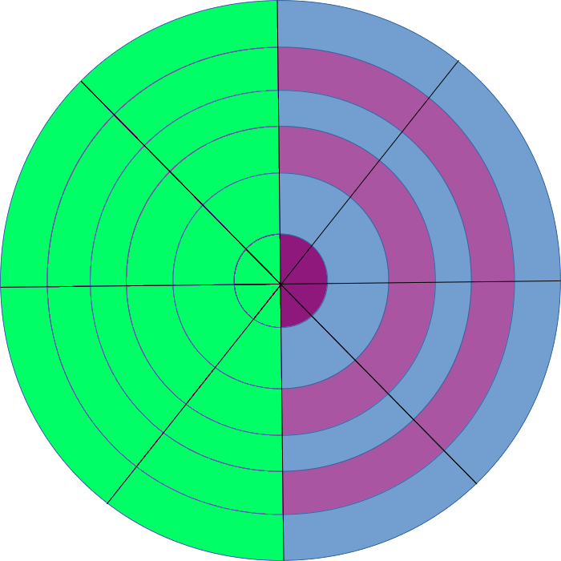

---

<!-- .slide: data-background="images/munich_g.jpg"  -->

## Munich

## 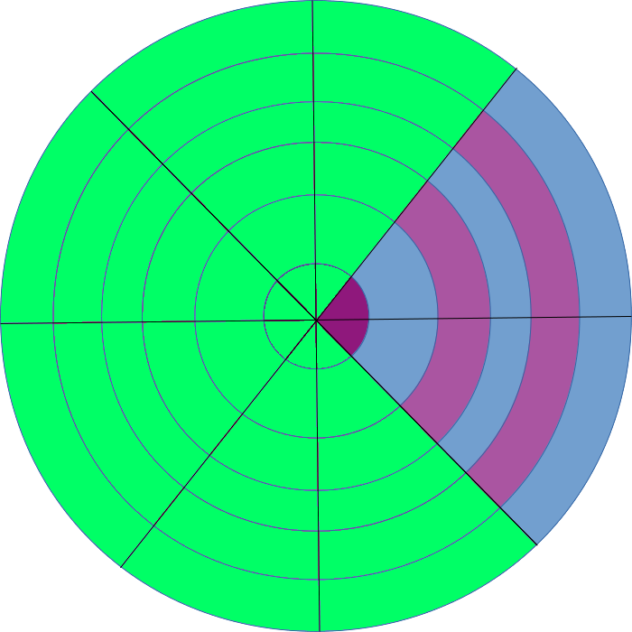

<!-- .slide: data-background="images/munich_g.jpg"  -->

## Munich

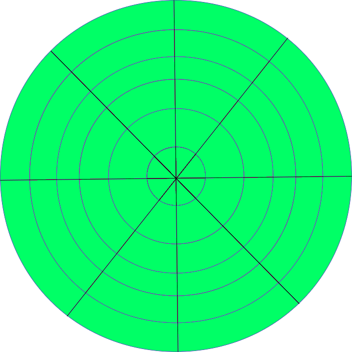

---

<!-- .slide: data-background="images/munich_g.jpg"  -->

## Munich Consequences

- \+ Prevents YAGNI <!-- .element: style="color: #4dff4dbd" -->
- \+ On-Rails <!-- .element: style="color: #4dff4dbd" -->
- \+ Avoid Mocks <!-- .element: style="color: #4dff4dbd" -->
- \+ More Time in the Green &rarr; Lower Risk <!-- .element:  style="color: #4dff4dbd" -->

---

<!-- .slide: data-background="images/stpauli.jpg"  -->

## St. Pauli <!-- .element: style="position: absolute; top: -280px; right: -40px" -->

---

<!-- .slide: data-background="images/stpauli_g.jpg"  -->


## Steven Collins

---

<!-- .slide: data-background="images/stpauli_g.jpg"  -->

# Motivation

### First Test Case:

### Complex &rarr; Simple

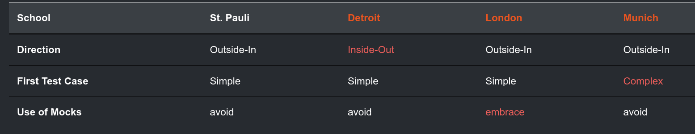

---

<!-- .slide: data-background="images/stpauli_g.jpg"  -->

## St. Pauli

- Outside-In
- Avoids Mocks
- Refactoring-based
- Triangulation &rarr; Simple/Growing Tests

---

<!-- .slide: data-background="images/stpauli_g.jpg"  -->

## Patterns & Principles

- Start on API-Level (DL-ATDD, Bache, Pryce/Freeman)
- Obvious Implementation (Beck)
- Fake It (Beck, Falco)
- **Triangulate** (Beck)
- Validation Tests (Collins)
- Append-Only Tests (Collins)

---

<!-- .slide: data-background="images/hamburg.jpg"  -->

## Hamburg <!-- .element: style="position: absolute; top: 400px; left: 350px" -->

---

<!-- .slide: data-background="images/hamburg_g.jpg"  -->

## Ralf Westphal

---

<!-- .slide: data-background="images/hamburg_g.jpg"  -->

# Motivation

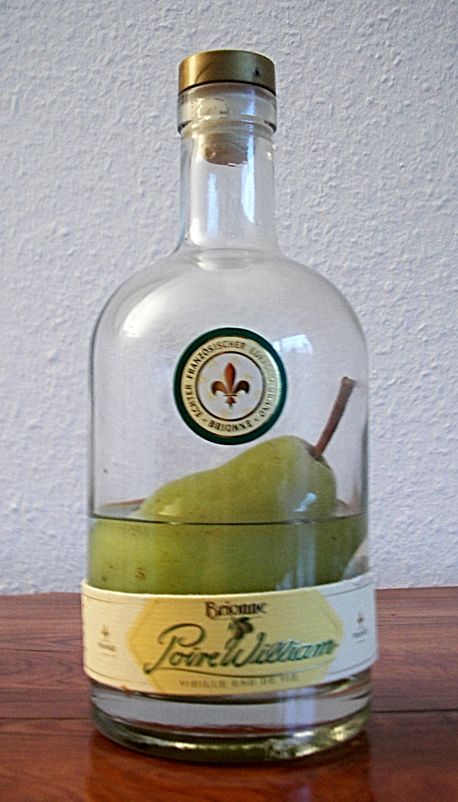

- Avoid "Pear Programming"
- Explicit DUF (Not BDUF)

---

<!-- .slide: data-background="images/hamburg_g.jpg"  -->

## Patterns & Principles

- Design Up Front
- Think Before Coding
- Analyze->Design->Code

---

<!-- .slide: data-background="images/london.jpg"  -->

## TDD as if <br/>You Meant It <!-- .element: style="position: absolute; top: 480px; left: -150px" -->

---

<!-- .slide: data-background="images/london_g.jpg"  -->

## Keith Braithwaite

---

<!-- .slide: data-background="images/london_g.jpg"  -->

## Motivation

- Make better Design Choices by Feedback
- YAGNI for Structure

---

<!-- .slide: data-background="images/london_g.jpg"  -->

## TDD as if <br/>You Meant It

- Inside-Out
- Write Production Code in Tests
- Refactor to Structure

---

<!-- .slide: data-background="images/london_g.jpg"  -->

## Patterns & Principles

- Implement in Test (Beck, Braithwaite)
  <br/>&rarr; Delay Design Decisions
- Extract Method/Class/... (Fowler)
- Rule of Three (Biggerstaff)
- Refactor to DSL

---

<!-- .slide: data-background="images/london_g.jpg"  -->

## Consequences

- Minimal structure <!-- .element:  style="color: #4dff4dbd" -->
- High Refacturability <!-- .element:  style="color: #4dff4dbd" -->
- Feels slow to start<!-- .element:  style="color: red" -->

---

<!-- .slide: data-background="images/trophy.jpg"   -->

# Best School? <!-- .element: style="position:relative; top: -200px " -->

Note:
wer hat gewonnen?

---

> It depends™

&mdash; any Consultant, ever <!-- .element: class="fragment" -->

---

<!-- .slide: data-background="images/tools.jpg"   -->

## Choose

## Best Tool

## for the job

---

<!-- .slide: data-background="images/blend.png"   -->

# Will it blend? <!-- .element: style="position:relative; top: -70px " -->

---

## References: General

- [Interview with Kent Beck](https://arialdomartini.wordpress.com/2012/07/20/you-wont-believe-how-old-tdd-is)
- [Martin Fowler: Mocks aren't Stubs](https://martinfowler.com/articles/mocksArentStubs.html#SoShouldIBeAClassicistOrAMockist)
- [Martin Fowler: Solitary or Sociable](https://martinfowler.com/bliki/UnitTest.html)
- [David Völkel: Mockist vs Classicists](https://www.youtube.com/watch?v=n62HN2DHDEU) - [Slides](https://de.slideshare.net/davidvoelkel/mockist-vs-classicists-tdd-69505839)
- [A Brief History of Mock Objects](http://www.mockobjects.com/2009/09/brief-history-of-mock-objects.html)
- [Book ATDD by Markus Gärtner](https://www.goodreads.com/book/show/13705173-atdd-by-example?from_search=true&from_srp=true&qid=uwc21eDQay&rank=1)

---

## References: Chicago

- [J.B. Rainsberger: Integrated Tests are a Scam](https://blog.thecodewhisperer.com/permalink/integrated-tests-are-a-scam)
- [J.B. Rainsberger: Universal Architecture](https://www.red-gate.com/blog/software-development/universal-architecture)
- [Justin Seals: Detroit school TDD](https://github.com/testdouble/contributing-tests/wiki/Detroit-school-TDD)
- Book: Test-Driven Development by Kent Beck

---

## References: London

- [Emily Bache: Double-Loop TDD](http://coding-is-like-cooking.info/2013/04/outside-in-development-with-double-loop-tdd/)
- Book: Growing Object Oriented Software Guided by Tests by Steve Freeman & Nat Price

---

## References: Munich

- [David Völkel: Fake-it Outside-In ITAKE](https://www.slideshare.net/DavidVlkel/fake-it-outsidein-tdd-itake-2018)
- [David Völkel: Fake-it Outside-In XP2017](https://de.slideshare.net/davidvoelkel/fake-it-outsidein-tdd-xp2017)
- [David Völkel: Screencasts (Youtube)](https://www.youtube.com/channel/UCevhQwU63dxJYPb8sZY-Zgg)

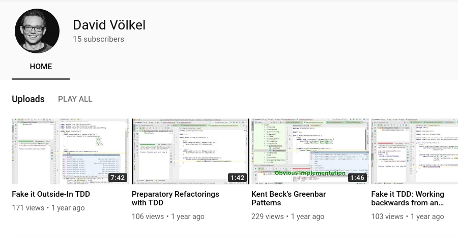

---

## References: St. Pauli

- [St. Pauli school of TDD](https://www.tddstpau.li/)

---

## References: Hamburg

- [Hamburg Style TDD](https://ralfw.de/hamburg-style-tdd/)
- [Hamburg Style TDD Diamond Kata](https://ralfw.de/hamburg-style-tdd-diamond-kata/)
- [Hamburg Style TDD Banking Kata](https://ralfw.de/hamburg-style-tdd-bank-kata/)

---

## References: TDDaiYMI

- [TDD as if You Meant It](https://www.infoq.com/presentations/TDD-as-if-You-Meant-It/)
- [TDD as if You Meant It - My turn!](https://melanieburns.net/blog/2019/12/tdd-as-if-you-meant-it-my-turn)

---

### Image Credits

<ul style="font-size: 15px">

- Kent Beck by Improve It on Flickr, CC BY-SA 2.0
- Making of Harry Potter - Karen Roe on Flickr, CC BY 2.0
- Children practicing Taekwondo in Kathmandu, Nepal by Adli Wahid on Unsplash, CC0
- Watch Where You're Putting That Thing: Chris Gilmore Follow, CC BY-SA 2.0
- [Map images from Googlemaps](https://drive.google.com/open?id=19PMzl5GRQOqTpN3WY9Z__lpoMaA8mzY3&usp=sharing)
- Drunken Kermit by Alexas Fotos on Pixabay, CC0
- Skyline Skyscraper by PIRO4D on Pixabay, CC0
- Detroit Photo by Sawyer Bengtson on Unsplash, CC0
- London Photo by Luca Micheli on Unsplash, CC0
- Munich Photo by Christoph Keil on Unsplash, CC0
- Lego Photo by Rick Mason on Unsplash, CC0
- Aerial view Zhangjiajie glass bridge by www.highestbridges.com
- Fire Motorcycle Stunt by digihanger on Pixabay, CC0
- Trophy by Fauzan Saari on Unsplash, CC0
- iPhone in Blender from Blendtec's Will It Blend? https://www.youtube.com/watch?v=lBUJcD6Ws6s
- Hamburg by liggraphy from Pixabay, CC0
- Backdoor by Claudio Schwarz on from Unsplah, CC0

</div>

---

# THX

## Feedback

@MarcoEmrich
@ThBrunzendorf
