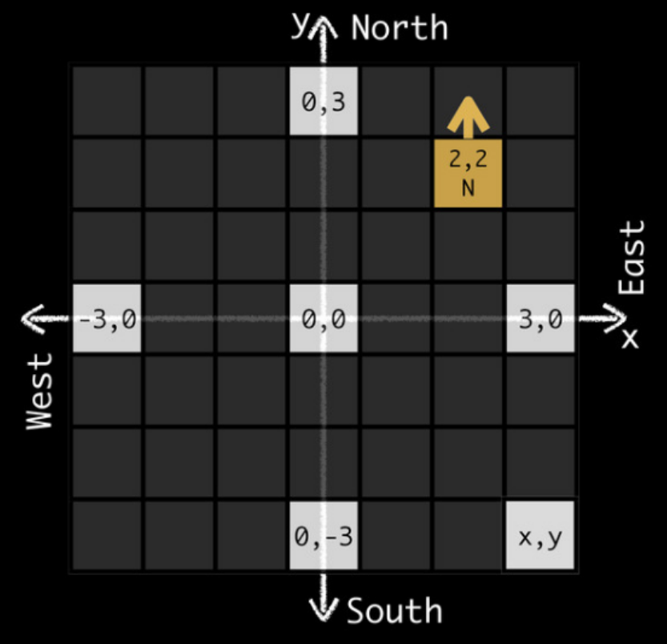
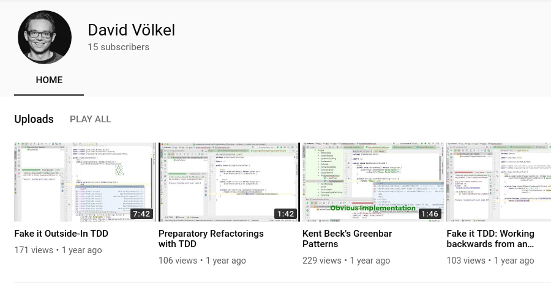

<!-- .slide: data-background="images/schools2.jpg"   -->

<h1 style="text-transform: none;">Schools of  Test-Driven Development</h1>

  Sebastian Rose (Bundesamt für Statistik)  
  Marco Emrich (codecentric)

       

Note:

Wer weiß welche Schule das ist?

- hier werden die Besten Magier ausgebildet

- anderes Bild, weil anderer Titel?

---

<!-- .slide: data-background="images/heart.jpg" data-background-size="contain" -->

# Welcome!

----

<!-- .slide: data-background="images/rgf.png" data-background-size="contain" -->

# TDD <!-- .element style="position: absolute; left: 650px; top: -300px" -->

---

<!-- .slide: data-background="images/typing.jpg" -->

What is the most

**time consuming activity**

in programming?

----

<!-- .slide: data-background="images/wheel_g.jpg" -->

- **A** - New features
- **B** - Refactoring
- **C** - Hunt for bugs

----

<!-- .slide: data-background="images/wheel_g.jpg" -->

- **A** - New features
- **B** - Refactoring
- **C** - Hunt for bugs <!-- .element style="color: red" -->

----

<!-- .slide: data-background="images/bugfixing.png" data-background-size="contain" data-background-color="white "-->

----

<!-- .slide: data-background="images/chest.png" data-background-size="contain"-->

# Secret

# of

# TDD

## Test Driven Development

----

<!-- .slide: data-background="images/apples.png" -->

# Quality Assurance?!

----

<!-- .slide: data-background="images/bees.jpg" -->

# Productivity!

----

<!-- .slide: data-background="images/lab.jpg" -->

# Research?

----

> The results […] indicate that [...] the resulting quality was higher than teams that adopted a non-TDD
> approach by an order of at least **two times**

&mdash; _Evaluating the Efficacy of Test-Driven Development_

Microsoft Research (2006)

----

> Test-first [...] did increase productivity probably because tests allow for better task understanding, better task focus, faster learning, and lower rework efforts

&mdash; _On the Effectiveness of Test-first Approach to Programming_

Carnegie Mellon University (2005)

---

> TDD is not about Testing

&mdash; everywhere on the Internet

----

> TDD is not **only** about Testing

&mdash; Sebastian & Marco (Just now)

----

<!-- .slide: data-background="images/design.jpg" -->

# TDD === Design

----

<!-- .slide: data-background="images/docs.jpg" -->

# Tests === Specs

----

<!-- .slide: data-background="images/docs.jpg" -->

# Living Documentation

----

<!-- .slide: data-background="images/ampel_g.png" -->

## String Calculator

## Kata

# "1,2,3" => 6

----

<!-- .slide: data-background="images/demo.jpg" -->

# Demo

---

<!-- .slide: data-background="images/ampel.png" data-background-size="contain" data-background-color="white" -->

----

<!-- .slide: data-background="images/tdd_alternative.png" data-background-size="contain" data-background-color="white" -->

----

<!-- .slide: data-background="images/tdd_not_strict.png" data-background-size="contain" data-background-color="white" -->

----

<!-- .slide: data-background="images/ampel_g.png" -->

# Arrange

# Act

# Assert

----

<!-- .slide: data-background="images/docs.jpg" -->

# Living Documentation

----

<!-- .slide: data-background="images/focus.jpg" -->

# Focus

----

<!-- .slide: data-background="images/mouse.jpg" -->

# SUT

### Subject under Test

----

<!-- .slide: data-background="images/isolation.jpg" -->

# Isolation

Notes:

Jest garantiert keine Reihenfolge, Tests dürfen sich nicht beeinflussen
=> Flaky Tests

----

<!-- .slide: data-background="images/babysteps.jpg" -->

# Baby Steps

----

# Download TDD-cycle PDF

---
<!-- .slide: data-background="images/hourglass.jpg" -->

# Time passes <!-- .element: style="position: relative; left: 300px" -->

----

<!-- .slide: data-background="images/ma1.jpg"  -->

# Schools of TDD <!-- .element: style="position: absolute; top: -300px;" -->

----

<!-- .slide: data-background="images/ma1_g.jpg"  -->

## TDD-Schools / Styles

- 1989 Chicago/Detroit
- 2009 London
- 2012 TDD as if You Meant It
- 2017 Munich
- 2018 (TCR: Test Commit Revert)
- 2019 Hamburg
- 2019 St.Pauli
- 2023 Portland (Nullables)
- 2024 AI-Driven

----

<!-- .slide: data-background="images/ma1_g.jpg"   -->

# Best School? <!-- .element: style="position:relative; top: -200px " -->

Note:
wer hat gewonnen?

----

<!-- .slide: data-background="images/ma1_g.jpg"   -->

> It depends™

&mdash; any Consultant, ever

Note:

- Bild?

----

<!-- .slide: data-background="images/tools.jpg"   -->

## Choose

## Best Tool

## for the job

----
<!-- .slide: data-background="images/ma1_g.jpg"  -->

# Coding Dojo
## Coderetreat Style

----
<!-- .slide: data-background="images/pair.png"  -->

----
<!-- .slide: data-background="images/todo.jpg"  -->

## TODOs Today <!-- .element: style="position: relative; top: -220px" -->

----
<!-- .slide: data-background="images/shipwreck.jpg"  -->

## No Shipping Day <!-- .element: style="position: relative; top: 380px" -->

---

<!-- .slide: data-background="images/setup_g.jpg"  -->

### Setup Java

* https://github.com/srose/kata-starter-java <!-- .element: style="color:white" -->
* mvn clean verify

 

### Setup JS/TS

* https://github.com/marcoemrich/kata-starter <!-- .element: style="color:white" -->
* npm install
* npm test

----
# Download Setup PDF

---

<!-- .slide: data-background="images/rover.jpg"  -->

# Coding Kata

       

# Mars Rover

----

- **Start:** 2,2 N
- **Commands:** "FLFF"
- **End:** 0,3 W

----

<!-- .slide: data-background="images/broken_wheel.jpg"  -->
# Broken Wheel
### "LFFFLFF"

----
# Download Kata PDF

---

<!-- .slide: data-background="images/chicago.jpg"  -->

# Chicago!

Note:

Let us start here, first "school", based on the basic introduction...

----

<!-- .slide: data-background="images/chicago_g.jpg"  -->

## Essentials

- **Inside-Out**
- **Sociable** Tests
- **Test Doubles** only for external dependencies

----

<!-- .slide: data-background="images/chicago_g.jpg"  -->

## Show

Note:
see show notes

----

<!-- .slide: data-background="images/chicago_g.jpg"  -->

## Consequences

- Can be fragile <!-- .element: style="color: red"-->
- Can be slow <!-- .element: style="color: red"-->
- Defect Localization is hard <!-- .element: style="color: red"-->

---

<!-- .slide: data-background="images/chicago.jpg"  -->

# modern Chicago!

----

<!-- .slide: data-background="images/chicago_g.jpg"  -->
## Essentials

- **Inside-Out**
- **Solitary/Isolated Tests**
- Many **Stubs**
- **Mocks** only if needed

----

<!-- .slide: data-background="images/chicago_g.jpg"  -->

## Show

Note:
see show notes

----

<!-- .slide: data-background="images/chicago_g.jpg"  -->

## Consequences

<ul>
  <li style="color: #4dff4dbd">+ ~~can be fragile~~ mostly stable</li>
  <li style="color: #4dff4dbd">+ ~~Can be slow~~ blazing fast</li>
  <li style="color: #4dff4dbd">+ Defect Localization is ~~hard~~ easy</li>
  <li style="color: red">- Additional Integration Tests needed</li>
</ul>

---

<!-- .slide: data-background="images/london.jpg"  -->

# London

----

<!-- .slide: data-background="images/london_g.jpg"  -->

## Essentials

- **Motivation:** YAGNI
- Outside-In
- Solitary/Isolated Tests
- Mocks for Verification

----

<!-- .slide: data-background="images/london_g.jpg"  -->

## Show

Note:
see show notes

----
<!-- .slide: data-background="images/london_g.jpg"  -->

## Consequences

- \+ Prevents YAGNI <!-- .element:  style="color: #4dff4dbd" -->
- \+ On-Rails <!-- .element:  style="color: #4dff4dbd" -->
- \+ Less refactoring <!-- .element:  style="color: #4dff4dbd" -->
- "Tell Don't Ask"-design <!-- .element:  -->
- \- Hard to refactor <!-- .element: style="color: red" -->
- \- Mocking is hard <!-- .element: style="color: red" -->

---

<!-- .slide: data-background="images/stpauli.jpg"  -->

# St. Pauli

----

<!-- .slide: data-background="images/stpauli_g.jpg"  -->

## Essentials

- **Outside-In**
- **Avoids Mocks**
- Simple Starter-Test
- Triangulation/Refactoring-based
- Append Only
- Validation Tests

----

<!-- .slide: data-background="images/stpauli_g.jpg"  -->

## Show
see show notes

----

<!-- .slide: data-background="images/stpauli_g.jpg"  -->

## Consequences

- Prevents YAGNI <!-- .element: style="color: #4dff4dbd" -->
- Avoid Mocks <!-- .element: style="color: #4dff4dbd" -->
- On-Rails <!-- .element: style="color: #4dff4dbd" -->
- Simpler than Munich <!-- .element: style="color: #4dff4dbd" -->
- Triangulation can be slow <!-- .element: style="color: red" -->

---

<!-- .slide: data-background="images/munich.jpg"  -->

# Munich

----

<!-- .slide: data-background="images/munich_g.jpg"  -->

## Essentials
- **Outside-In**
- **Avoids Mocks**
- temporary in-production Stubs/Fakes
- Refactoring-based
- Complex Acceptance Test

----

<!-- .slide: data-background="images/munich_g.jpg"  -->

## Show
Note: see show notes

----

<!-- .slide: data-background="images/munich_g.jpg"  -->

## Consequences

- Prevents YAGNI <!-- .element: style="color: #4dff4dbd" -->
- Avoid Mocks <!-- .element: style="color: #4dff4dbd" -->
- On-Rails <!-- .element: style="color: #4dff4dbd" -->
- More Time in the Green &rarr; Lower Risk <!-- .element:  style="color: #4dff4dbd" -->

---

<!-- .slide: data-background="images/hamburg.jpg"  -->

# Hamburg

----

<!-- .slide: data-background="images/hamburg_g.jpg"  -->

## Essentials

- **Motivation:** Think Before Coding
- Design Up Front (BDUF vs. DUF)
- Analyze->Design->Code

----

<!-- .slide: data-background="images/hamburg_g.jpg"  -->

## Show

Note:

- Step back and do design (15 min.)
- Before code: design, detailed as you like
- Implement the way you like?
----

<!-- .slide: data-background="images/hamburg_g.jpg"  -->

## Consequences

- Avoids "Pear-Programming" <!-- .element: style="color: #4dff4dbd" -->
- Clear Understanding of the Business Problem <!-- .element: style="color: #4dff4dbd" -->
- DUF can be wrong <!-- .element: style="color: red" -->

---

<!-- .slide: data-background="images/london.jpg"  -->

## TDD as if  You Meant It <!-- .element: style="position: absolute; top: 480px; left: -150px" -->

Note:
- also born in London because of the picture?

----

<!-- .slide: data-background="images/london_g.jpg"  -->

## Essentials

- **Motivation:** Feedback-Driven Design
- Inside-Out
- Write Production Code in Tests as long as possible
   &rarr; Delay Design Decisions
- Refactor to Structure

----

<!-- .slide: data-background="images/london_g.jpg"  -->

## Show

Note:
see show notes

----

<!-- .slide: data-background="images/london_g.jpg"  -->

## Consequences

- Minimal structure <!-- .element:  style="color: #4dff4dbd" -->
- High Refacturability <!-- .element:  style="color: #4dff4dbd" -->
- Feels slow to start<!-- .element:  style="color: red" -->

---

<!-- .slide: data-background="images/portland.jpg"  -->

## Portland <!-- .element: style="position: absolute; top: 480px; left: -150px" -->

----

<!-- .slide: data-background="images/portland_g.jpg"  -->

## James Shore

----

<!-- .slide: data-background="images/portland_g.jpg"  -->

## Motivation

Avoid Mocks (even for I/O)

----

<!-- .slide: data-background="images/portland_g.jpg"  -->

## Patterns & Principles

- Testing With Nullables
- Testing Without Mocks: A Pattern Language
[&rightarrow;Link](https://www.jamesshore.com/v2/projects/nullables/testing-without-mocks)
- Sociable Tests

----

## Sociable vs Solitary

(*) from M. Fowler/ J. Fields

----

<!-- .slide: data-background="images/portland_g.jpg"  -->

## Portland

- Sociable Tests
- Avoid Test-Doubles/Mocks
- No integration tests needed <!-- .element:  style="color: #4dff4dbd" -->
- Nullables in Production <!-- .element:  style="color: red" -->

---
<!-- .slide: data-background="images/mirror.jpg"  --> <!-- .element: style="position: relative; left: 250px" -->
# Retro

---

# THX

## Feedback

@MarcoEmrich
Sebastian Rose (LinkedIn)

----
# Download giveaway PDFs

---

## References: General

- [Interview with Kent Beck](https://arialdomartini.wordpress.com/2012/07/20/you-wont-believe-how-old-tdd-is)
- [Martin Fowler: Mocks aren't Stubs](https://martinfowler.com/articles/mocksArentStubs.html#SoShouldIBeAClassicistOrAMockist)
- [Martin Fowler: Solitary or Sociable](https://martinfowler.com/bliki/UnitTest.html)
- [David Völkel: Mockist vs Classicists](https://www.youtube.com/watch?v=n62HN2DHDEU) - [Slides](https://de.slideshare.net/davidvoelkel/mockist-vs-classicists-tdd-69505839)
- [A Brief History of Mock Objects](http://www.mockobjects.com/2009/09/brief-history-of-mock-objects.html)
- [Book ATDD by Markus Gärtner](https://www.goodreads.com/book/show/13705173-atdd-by-example?from_search=true&from_srp=true&qid=uwc21eDQay&rank=1)

----

## References: Chicago

- [J.B. Rainsberger: Integrated Tests are a Scam](https://blog.thecodewhisperer.com/permalink/integrated-tests-are-a-scam)
- [J.B. Rainsberger: Universal Architecture](https://www.red-gate.com/blog/software-development/universal-architecture)
- [Justin Seals: Detroit school TDD](https://github.com/testdouble/contributing-tests/wiki/Detroit-school-TDD)
- Book: Test-Driven Development by Kent Beck

----

## References: London

- [Emily Bache: Double-Loop TDD](http://coding-is-like-cooking.info/2013/04/outside-in-development-with-double-loop-tdd/)
- Book: Growing Object Oriented Software Guided by Tests by Steve Freeman & Nat Price

----

## References: Munich

- [David Völkel: Fake-it Outside-In ITAKE](https://www.slideshare.net/DavidVlkel/fake-it-outsidein-tdd-itake-2018)
- [David Völkel: Fake-it Outside-In XP2017](https://de.slideshare.net/davidvoelkel/fake-it-outsidein-tdd-xp2017)
- [David Völkel: Screencasts (Youtube)](https://www.youtube.com/channel/UCevhQwU63dxJYPb8sZY-Zgg)

----

## References: St. Pauli

- [St. Pauli school of TDD](https://www.tddstpau.li/)

----

## References: Hamburg

- [Hamburg Style TDD](https://ralfw.de/hamburg-style-tdd/)
- [Hamburg Style TDD Diamond Kata](https://ralfw.de/hamburg-style-tdd-diamond-kata/)
- [Hamburg Style TDD Banking Kata](https://ralfw.de/hamburg-style-tdd-bank-kata/)

----

## References: TDDaiYMI

- [TDD as if You Meant It](https://www.infoq.com/presentations/TDD-as-if-You-Meant-It/)
- [TDD as if You Meant It - My turn!](https://melanieburns.net/blog/2019/12/tdd-as-if-you-meant-it-my-turn)

----

## References: Portland

* Overview: https://www.jamesshore.com/v2/projects/nullables
* Article: https://www.jamesshore.com/v2/projects/nullables/testing-without-mocks
* Course: https://www.jamesshore.com/v2/courses/testing-without-mocks

----

### Image Credits

<ul style="font-size: 15px">

- TODO-Tatoo von Rob and Stephanie Levy
- Kent Beck by Improve It on Flickr, CC BY-SA 2.0
- Making of Harry Potter - Karen Roe on Flickr, CC BY 2.0
- Children practicing Taekwondo in Kathmandu, Nepal by Adli Wahid on Unsplash, CC0
- Watch Where You're Putting That Thing: Chris Gilmore Follow, CC BY-SA 2.0
- [Map images from Googlemaps](https://drive.google.com/open?id=19PMzl5GRQOqTpN3WY9Z__lpoMaA8mzY3&usp=sharing)
- Drunken Kermit by Alexas Fotos on Pixabay, CC0
- Skyline Skyscraper by PIRO4D on Pixabay, CC0
- Detroit Photo by Sawyer Bengtson on Unsplash, CC0
- London Photo by Luca Micheli on Unsplash, CC0
- Munich Photo by Christoph Keil on Unsplash, CC0
- Lego Photo by Rick Mason on Unsplash, CC0
- Aerial view Zhangjiajie glass bridge by www.highestbridges.com
- Fire Motorcycle Stunt by digihanger on Pixabay, CC0
- Trophy by Fauzan Saari on Unsplash, CC0
- iPhone in Blender from Blendtec's Will It Blend? https://www.youtube.com/watch?v=lBUJcD6Ws6s
- Hamburg by liggraphy from Pixabay, CC0
- Backdoor by Claudio Schwarz on from Unsplah, CC0

